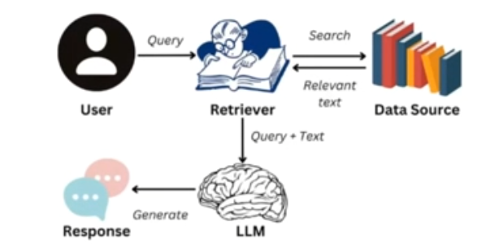
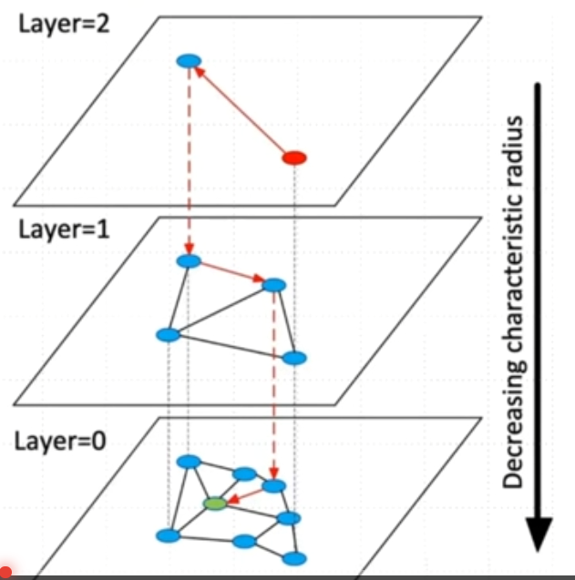
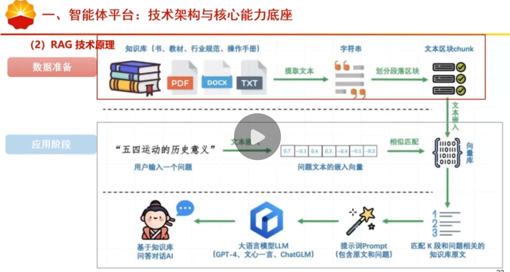
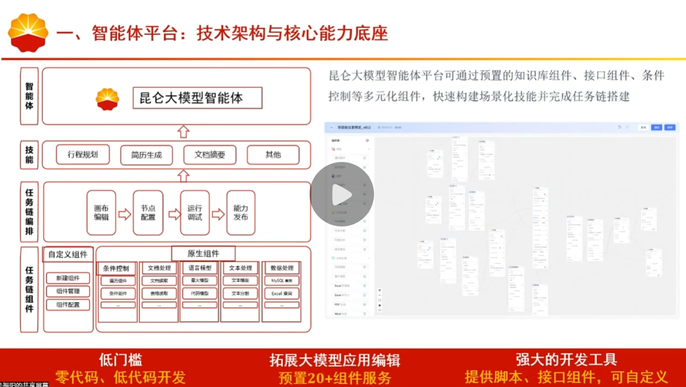
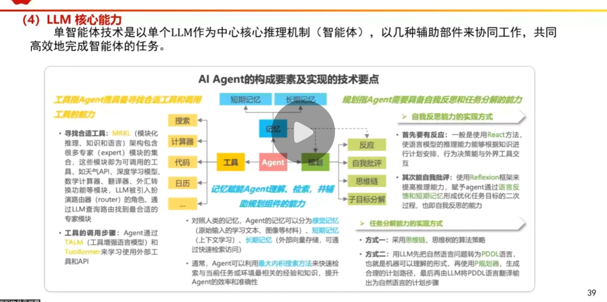
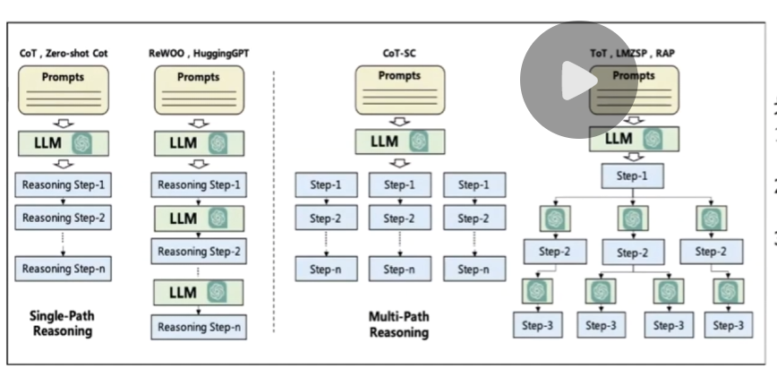
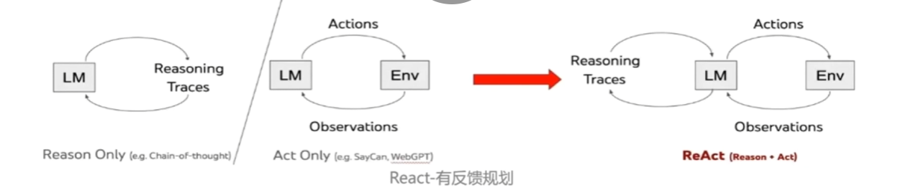
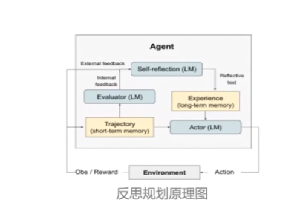
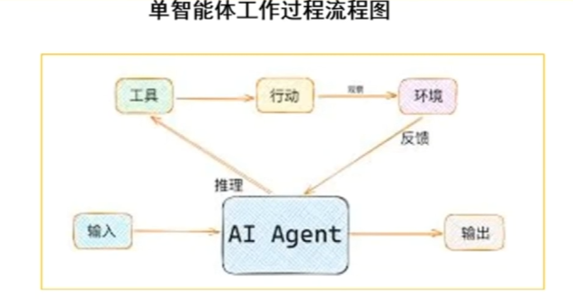
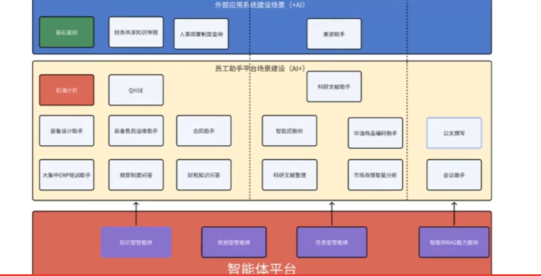

规划型智能体:适用于多类型技能综合调用的智能体,如一个智能体包含工具,任务链,知识库等多个技能.  
如办公助理,超级助手等.  
特性:综合型智能体,需要任务规划和抽槽  

任务型智能体:根据业务流程和工作流程设计任务链,一个任务完成后把结果按编排顺序交给下一个任务执行,  
直至任务链结束  
特性:不需要任务规划  

知识型智能体:适用于单一知识库,跨多个知识库的知识问答的场景  
特性:支持跨多个知识库的知识问答  

知识库是智能体存储其关于环境的初始知识的地方.知识库的引入可以让智能体对专业领域的知识有一定的适配性,从而  
提高任务处理的深度和准确度  

RAG技术原理  
根据用户上传的文本把知识文本切块,用嵌入模型转成向量存向量库,用户提问时,同样转成向量去库中检索相似文本块  
再结合这些内容,由大语言模型(LLM)生成回答,还可借助记忆库关联上下文,实现用外部知识辅助大模型精准,贴合场景地  
回应问题,解决模型知识局限与保证回答质量  

为什么需要RAG  
通用的大型语言模型虽然知识渊博,但在应用于特定业务场景时,往往会遇到以下瓶颈  
1.局限性:LLM的知识被其训练数据所限制,对于训练截止日期之后的实时信息、非公开的内部数据或高度专业的领域知识  
它无法直接获取  
2."幻觉"问题:当被问及超出其知识范围的问题时,LLM有时会"一本正经地胡说八道",即生成看似合理但实际上是错误的  
或捏造的信息  
3.安全性:企业或个人通常不愿将敏感的私有数据上传至第三方LLM服务器提供商进行模型训练,这带来了严重的数据隐私和  
安全风险  

微调后的大模型:成本高  
检索增强:成本低  

什么是检索增强生成RAG(Retrieval Augmented Generation)  
在让LLM回答问题之前,先从一个可信的外部知识库中检索相关信息,然后将这些信息与原始问题一并提供给LLM,  
让它"参考"这些信息来生成答案  
RAG=外部知识检索+LLM内容生成  

  

RAG的完整工作流程通常分为两个主要阶段  
数据准备:这个阶段的目标将原始文档资料转化为可供快速检索的格式,通常是向量形式,并存入专门的数据库  
应用阶段:用户与RAG系统直接交互的过程,是实时的  

数据准备:  
1.数据提取与下载:从不同的数据源加载原始数据  
2.文本分段(Chunking):将长文档切分成较小的,语义完整的文本块.这是因为LLM的输入长度有限,并且更小  
的文本块有助于进行更精确的检索  
3.向量化:使用一个称为"嵌入模型"(Embedding Model)的AI模型,将每个文本块转化成一个能够代表其语义  
的数学向量(一串数字)  
4.数据入库:将文本块及其对应的向量存储在向量数据库(Vector Database)中.经过特殊优化,可以极快地根据  
向量的相似性进行搜索  

FAISS(Meta开源向量数据库):解决高维向量数据的快速检索问题  

IVF索引:  
建索引时,用K-means把数据库全部向量分成n个簇,每个簇对应一个簇中心vector  
每个向量只存储在它所属簇的倒排bucket里  
检索时,找出query最近的n个簇中心,只搜索这些簇里的向量  

分层可导航小世界  
HNSW是一种基于图的索引方法,向量被组织在小世界图的层次结构中  
图中的每个节点(向量)都与其最近临节点相连  
搜索时,算法在图中导航,快速收敛到最近的向量  

  

  

应用阶段  
1.用户提问:用户向系统提出一个问题(Query)  
2.查询向量化:系统使用与数据准备阶段相同的嵌入模型,将用户的问题也转换成一个向量  
3.数据检索(Retrieval):系统在向量数据库中搜索与用户问题最相似的文本块向量,从而找出  
与问题最相关的几个文本块  
4.知识增强(Augmented):将检索到的文本块(作为背景知识)与用户的原始问题整合到一个提示(Prompt)中  
5.答案生成(Generation):将这个增强后的提示发送给LLM,LLM会根据提供的背景知识生成最终的,精准的答案  

问题改写  
用户的原始问题往往存在表述模糊,逻辑复杂或包含多个细分问题的情况  
问题改写是借助大语言模型(LLM)的只能能力,将原始问题"转化"或"拆解"为更适配检索的形式   
口语化术语$\rightarrow$行业术语,补充缺失的信息  

双检索  
第一阶段:关键词  
TF-IDF+BM25:基于词频和逆文档频率的经典算法,衡量关键词在文档中的重要性  
第二阶段:语义向量  
文本编码:使用一个预训练的语言模型将知识库里的所有文档和用户的查询转换成高维的数学向量  
向量相似度计算:在这个向量空间中,计算用户查询向量与所有文档向量之间的距离  
返回结果:将距离最近的文档作为检索结果返回  

  

业务背景  
需求场景:业务人员可以通过上传会议纪要,公文等文档,利用任务链能力获取文档中的大纲,并按照自己的设置的提示词工程进行扩写生成报告  

文档读取:解析并读取文档中的内容  
通用大模型:调用通用大模型接口,利用通用大模型能力进行流式输出  

Prompt信息  
角色:让AI扮演什么身份?这决定了它的语气,知识和思考角度  
技能/任务:需要AI具体执行哪些步骤或运用哪些专业知识  
限制:必须遵守哪些规则?避免哪些内容?这能提高答案的精准度  
实例/输出格式:提供一个具体的输入输出例子,或者明确规定回答的格式  

提示词(prompt)是什么  
提示词工程(Prompt Engineering)是AI时代高效调用大模型的核心技能,通过精准设计指令,让模型输出  
更贴合需求,更具实用性的结果.其核心逻辑是"清晰传递意图,提供充分支撑,明确输出标准"  

提示词设计的核心原则  
1.清晰具体无歧义:避免"可能""大概"等模糊表述,用量化指标明确要求,比如"分3点说明""500字之内"  
"突出3个核心案例"  
2.任务目标明确化:明确说明任务类型(分析/总结/创作等),核心目的(解决什么问题),输出形式(表格/列表/短文等)  
3.迭代优化思维:复杂任务需多轮细化,先出框架再补细节,基于初始输出提出修正要求,逐步逼近理想结果   

入门必学的常用技巧  
1.零样本提示:直接下达指令,不提供实例,适用于简单常见任务,比如"将人工智能赋能教育"翻译成英文  
2.实例提示:提供2~3个输入输出示例,帮助模型理解模式,比如改写语气,格式转换等场景,实例需要高质量且贴合需求  
3.角色提示:让模型扮演特定身份,激活对应领域知识,比如"假设你是5年经验的产品经理,分析短视频APP的用户留存策略"  
4.格式约束提示:明确输出形式,比如"以Markdown表格呈现,包含'优点''不足''建议'三列""用JSON格式输出核心信息"  
5.否定式提示:明确禁止不需要的内容,比如"不使用专业术语""避免冗长铺垫""不要列举无关案例"  

ICIO框架  
Context(上下文)  
Instruction(指令)  
Input(输入)  
Output(输出)  

CRISPE  
BROKE   
RASCEF  

规划型智能体   
1.任务规划   
2.技能选择   
3.任务执行   
4.结果返回   

AutoGPT  
GPT-Engineer  
HuggingGPT  
BabyAGI  

单智能体技术是以单个LLM作为中心核心推理机制(智能体),以几种辅助部件来协同工作,共同高效  
地完成智能体的任务  

 

工具指Agent需具备寻找合适工具和调用工具的能力  
寻找合适工具:MRKL架构  
工具的调用步骤,Agent通过TALM(工具增强语言模型)和Toolformer来学习使用外部工具和API  

规划:反应,自我批评,思维链,子目标分解  

PDDL语言,P规划器  

构成智能体的大模型所承担和实现的,其重点在于对于任务进行精细的分解和子任务进行周密的规划  
规划可以分为反思规划,无反馈规划,有反馈规划,分治规划等  

zero-shot(零样本)和Reasoning-chain(思维链),以及prompt工程进行无反馈推理:  
1.将复杂的大任务"化整为零",拆解成一个个可管理的小任务  
2.为每一个小任务构建出可以执行的微小策略步骤  
3.通过微小策略步骤的累积,形成复杂任务的整体解决   
   

有反馈规划  
1.思考(Thought):首先,面对一个问题,我们需要进行深入的思考.这个思考过程是关于如何定义问题,确定解决问题所需的关键信息和推理步骤  
2.行动(action):确定了思考的方向后,接下来就是行动的时刻.根据我们的思考,采取响应的措施或执行特定的任务,以期望推动问题向解决的方向发展  
3.观察(Observation):行动之后,我们必须仔细观察结果.这一步是检验我们的行动是否有效,是否接近了问题的答案  
4.循环迭代  
5.如果观察到的结果并不匹配我们预期的答案,那么就需要回到思考阶段,重新审视问题和行动计划.这样,我们就开始了新一轮的TAO循环,直到找到问题的解决方案  

   

反思规划  
经典方法:Reflexion框架  
Reflexion由3个不同的模型组成:Actor,Evaluator,Self-Reflection  
1.Actor模型使用大语言模型(LLM)来生成文本和动作,并在环境中接受观察结果  
2.Evaluator模型负责评估Actor产生的轨迹的质量,并计算一个奖励分数以反映其性能  
3.Self-Reflection模型则对反馈内容进行反思,为后续流程提供有价值的反馈信息  
4.这三个模型共同协作,在任务中不断迭代优化,从而提高决策能力  

   

分治规划  
分治规划是一种经典的算法设计策略,其核心思想是将复杂问题分解为多个较小,更小的子问题.  

短期记忆:上下文学习,处理复杂任务的临时存储空间,受Transformer有限的上下文窗口长度限制   
长期记忆:在查询时智能体Agent可以关注的外部向量存储,具有快速检索和基本无限的存储容量   

目前AI智能体对于外部工具可以总结为两种使用方式:  
一个是需要使用API:即为需要外部的应用程序来进行帮助大模型生成,通过特定格式请求调用工具系统执行相应功能  
返回结果供AI-LLM继续处理   
一种是不需要使用API:(本地函数,与外界几乎没有什么交互)   

单智能体工作流程:   
1.智能体接受来自环境的输入信息   
2.基于接收到的输入,智能体进行推理和处理   
3.智能体利用各种工具来辅助其决策和行动  
4.智能体根据推理结果采取相应的行动智能体的行动会对环境产生影响,并从环境中获得反馈   
5.智能体将处理后的信息或决策作为输出返回   

   

一键同步桌面客户端:智能体应用可一键同步企业超级助理桌面客户端  
端到端接入:平台构建的智能体,可提供API接口,满足端到端调用   
H5页面:分享地址链接,用户可直接打开体验   

智能体在能源化工行业的应用案例   
1.外部应用系统,岩石鉴别,财务共享知识随查这些垂直工具  
2.更丰富的员工助手平台,覆盖石油计价,QHSE,装备设计,合同管理等近20个具体场景  
从日常制度问答,ERP培训,到科研文献整理,市场分析,把智能渗透到了业务  

   

