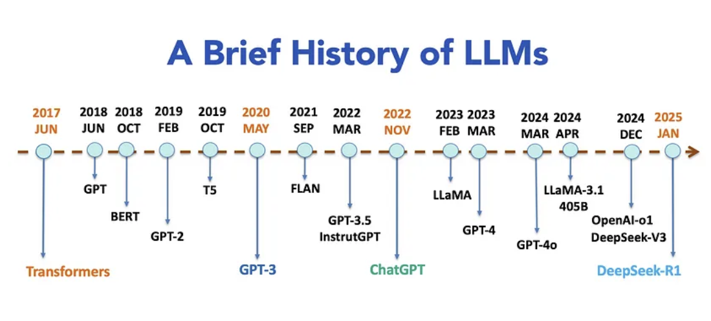
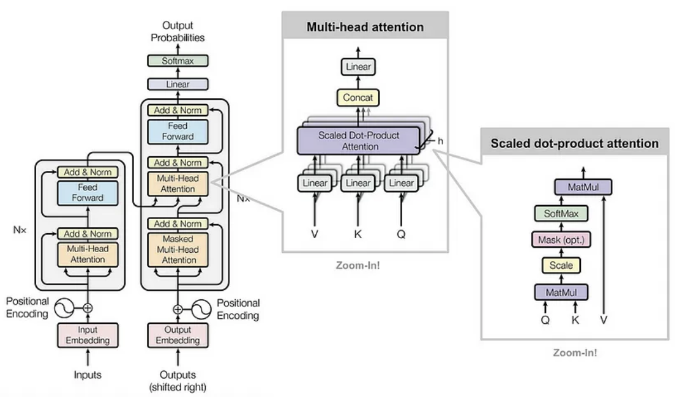
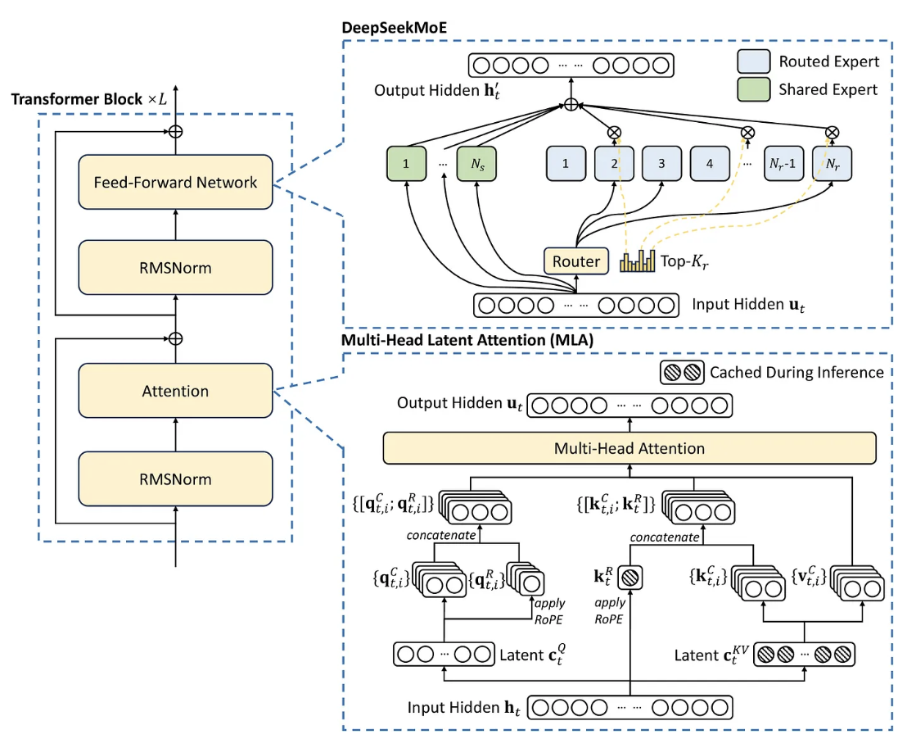

大语言模型进化史,从Transformer到DeepSeek-R1的AI变革之路  
本文将回顾大语言模型的发展历程  
从2017年具有革命性的Transformer架构开始,它通过自注意力机制重新定义了自然语言处理(NLP)  
我们见证了BERT和GPT这样的模型崛起,它们改变了上下文理解和生成能力,最终诞生了拥有1750亿参数的GPT-3  
文章还将探讨如何通过监督微调(SFT,Supervised Fine-tuning)和人类反馈强化学习(RLHF,Reinforcement Learning from Human Feedback)  
来解决大语言模型中的"幻觉"问题,即生成的文本与事实相矛盾  
到2023年,像GPT-4这样的多模态模型整合了文本,图像和音频,而像OpenAI-o1和DeepSeek-R1这样的推理模型则突破了复杂问题解决的界限  
  

# 1.什么是语言模型  
语言模型是人工智能（AI）系统，旨在处理、理解和生成类似人类语言的内容。  
它们从大型数据集中学习模式和结构，能够生成连贯且与上下文相关的文本，应用领域包括翻译、摘要、聊天机器人和内容生成等。  

自回归语言模型  
大多数大语言模型以自回归方式运行，这意味着它们根据前面的词元（或子词）序列来预测下一个词元的概率分布。  
这种自回归特性使模型能够捕捉复杂的语言模式和依赖关系。  
在文本生成过程中，大语言模型通过解码算法确定下一个输出词元。  
这个过程可以采用不同的策略:可以选择概率最高的词元（即贪心搜索），也可以从预测的概率分布中随机采样一个词元。  
后一种方法使得每次生成的文本都可能有所不同，这一特点与人类语言的多样性和随机性非常相似。  

生成能力  
大语言模型的自回归特性使它们能够通过利用前面单词建立的上下文，一次生成一个词元，按顺序生成文本。  
从一个初始词元或提示开始，模型迭代地预测下一个词元，直到形成完整的序列或满足预定义的停止条件。  
为了生成对提示的完整回答，大语言模型会通过将先前选择的词元添加到输入中来进行迭代查询。  
这种生成能力为多种应用提供了支持，包括创意写作、对话式人工智能和自动化客户支持系统。  

# 2.Transformer革命(2017)  
2017年，Vaswani等人在他们的开创性论文《Attention is All You Need》中提出了Transformer架构，  
这标志着自然语言处理领域的一个分水岭时刻。  
它解决了早期模型（如循环神经网络（RNN）和长短期记忆网络（LSTM））的关键局限性，这些早期模型在处理长距离依赖和顺序处理时存在困难。  
这些挑战使得使用RNN或LSTM实现有效的语言模型变得困难，因为它们计算效率低下，并且容易出现梯度消失等问题。  
而Transformer克服了这些障碍，彻底改变了该领域，并为现代大语言模型奠定了基础。  
  

Transformer架构的关键创新  
自注意力机制  
与按顺序处理词元且难以处理长距离依赖的RNN不同，Transformer使用自注意力机制来衡量每个词元相对于其他词元的重要性。  
这使得模型能够动态地关注输入的相关部分。数学公式如下:  
$Attention(Q,K,V)=Softmax(\frac{QK^T}{\sqrt{d_k}})V$  
这里，Q、K、V分别是查询、键和值矩阵,$d_k$是键的维度。   
自注意力机制实现了并行计算，加快了训练速度，同时提高了对全局上下文的理解。  

多头注意力  
多个注意力头并行操作，每个头关注输入的不同方面。  
它们的输出被连接起来并进行转换，从而实现更丰富的上下文表示。  

前馈网络和层归一化  
每个Transformer层都包括应用于每个词元的前馈网络，以及层归一化和残差连接。  
这些操作稳定了训练过程，并支持更深层次的架构  

位置编码   
由于Transformer本身并不对词元顺序进行编码，因此添加了位置编码（位置和频率的正弦函数）来表示单词顺序，  
在不牺牲并行化的情况下保留了顺序信息。  

对语言建模的影响  
1.可扩展性:Transformer实现了完全并行化计算，使得在大型数据集上训练大规模模型成为可能。  
2.上下文理解:自注意力机制能够捕捉局部和全局依赖关系，提高了文本的连贯性和上下文感知能力。  

Transformer架构的引入为构建大规模、高效的语言模型奠定了基础，这些模型能够以前所未有的精度和灵活性处理复杂任务。  

# 3.预训练Transformer时代(2018~2020)  
2017年Transformer架构的引入为自然语言处理开启了一个新时代，其特点是预训练模型的兴起以及对模型规模前所未有的关注。  
这一时期出现了两个具有影响力的模型家族：BERT和GPT，它们展示了大规模预训练和微调范式的强大力量。  

BERT:双向上下文理解(2018)  
2018年，谷歌推出了BERT(Bidirectional Encoder Representations from Transformers),  
这是一个开创性的模型，它使用Transformer的编码器，在广泛的自然语言处理任务中取得了最先进的性能。  
与之前单向处理文本（从左到右或从右到左）的模型不同，BERT采用了双向训练方法，使其能够同时从两个方向捕捉上下文。  
通过生成深度的、上下文丰富的文本表示，BERT在文本分类、命名实体识别（NER）、情感分析等语言理解任务中表现出色。  

BERT的关键创新点包括  
1.掩码语言建模(MLM):BERT不是预测序列中的下一个单词，而是被训练来预测句子中随机掩码的词元。  
这迫使模型在进行预测时考虑句子的整个上下文——包括前面和后面的单词。  
2.下一句预测(NSP):除了MLM，BERT还在一个名为下一句预测的次要任务上进行训练，  
在这个任务中，模型学习预测两个句子在文档中是否连续。  
这有助于BERT在需要理解句子之间关系的任务中表现出色，如问答和自然语言推理。  

BERT的影响：BERT的双向训练使其在GLUE（通用语言理解评估）和SQuAD（斯坦福问答数据集）等基准测试中取得了突破性的性能。  
它的成功展示了上下文嵌入的重要性——这种表示会根据周围的单词动态变化，为新一代预训练模型铺平了道路。  

GPT:生成式预训练和自回归文本生成(2018~2020)  
虽然BERT优先关注双向上下文理解，但OpenAI的GPT系列采用了不同的策略，通过自回归预训练专注于生成能力。  
通过使用Transformer的解码器，GPT模型作为用于文本生成的自回归语言模型表现出色。  

1.GPT-1(2018):2018年发布的GPT第一个版本是一个大规模Transformer模型，
它被训练来预测序列中的下一个单词，类似于传统的语言模型  
单向自回归训练:GPT使用因果语言建模目标进行训练，在这种训练方式中，模型仅根据前面的词元预测下一个词元。   
这使得它特别适合文本完成、摘要和对话生成等生成任务。  
下游任务微调:GPT的关键贡献之一是它能够针对特定的下游任务进行微调，而无需特定任务的架构。  
通过简单地添加一个分类头或修改输入格式，GPT可以适应情感分析、机器翻译和问答等任务  

2.GPT-2(2019):在原始GPT成功的基础上，OpenAI发布了GPT-2，这是一个更大的模型，拥有15亿个参数。  
GPT-2展示了令人印象深刻的零样本能力，这意味着它可以在没有任何特定任务微调的情况下执行任务。  
例如，它可以生成连贯的文章、回答问题，甚至在没有明确训练的情况下进行语言翻译  

Zero-shot(零样本):The model predicts the answer given only a natural language description  
of the task.No gradient updates are performed.  

3.GPT-3(2020):GPT-3的发布标志着语言模型规模扩展的一个转折点。  
它拥有惊人的1750亿个参数，突破了大规模预训练的可能性边界。  
它展示了卓越的少样本和零样本学习能力，在推理过程中只需极少甚至无需示例就能执行任务。  
GPT-3的生成能力扩展到创意写作、编码和复杂推理任务，展示了超大规模模型的潜力  

One-shot(单样本):In addition to the task description,the model sees a single example of the task.  
No gradient updates are performed.  

Few-shot(少样本):In addition to the task description,the model sees a few examples of the task.  
No gradient updates are performed.  

GPT的影响和规模的作用   
GPT模型，特别是GPT-3的推出，标志着人工智能领域的一个变革时代，展示了自回归架构和生成能力的强大力量。  
这些模型为内容创作、对话代理和自动推理等应用开辟了新的可能性，在广泛的任务中实现了接近人类的性能。  
拥有1750亿参数的GPT-3展示了规模的深远影响，证明了在大量数据集上训练的更大模型可以在人工智能能力方面树立新的标杆  

语言建模性能会随着模型规模、数据集大小以及训练所用计算资源的增加而稳步提升  

在2018年至2020年期间，该领域受到对规模的不懈追求的驱动。  
研究人员发现，随着模型规模从数百万参数增长到数十亿参数，它们在捕捉复杂模式和泛化到新任务方面表现得更好。  
这种规模效应得到了三个关键因素的支持:
1.数据集大小:更大的模型需要大规模的数据集进行预训练。例如，GPT-3在大量的互联网文本语料库上进行训练，  
使其能够学习到多样化的语言模式和知识领域  
2.计算资源:强大的硬件（如GPU和TPU）的可用性，以及分布式训练技术，使得高效训练拥有数十亿参数的模型成为可能  
3.高效架构:混合精度训练和梯度检查点等创新技术降低了计算成本，使得在合理的时间和预算范围内进行大规模训练更加可行  

这个规模扩展的时代不仅提升了语言模型的性能，还为未来人工智能的突破奠定了基础，  
强调了规模、数据和计算在实现最先进成果方面的重要性  

# 4.训练后对齐:弥合人工智能与人类价值观的差距(2021~2022)  
拥有1750亿参数的大语言模型GPT-3能够生成几乎与人类写作难以区分的文本，这引发了人们对人工智能生成内容的真实性和可信度的严重担忧。  
虽然这一成就标志着人工智能发展的一个重要里程碑，但它也凸显了确保这些模型与人类价值观、偏好和期望保持一致的关键挑战。一个主要问题是 “幻觉”，  
即大语言模型生成的内容在事实上是错误的、无意义的，或者与输入提示相矛盾，给人一种 “一本正经胡说八道” 的印象。为了解决这些挑战，  
2021年和2022年研究人员专注于提高大语言模型与人类意图的一致性并减少幻觉，从而开发出了监督微调（SFT）和人类反馈强化学习（RLHF）等技术。  

1.监督微调(SFT)  
增强GPT-3对齐能力的第一步是监督微调（SFT），它是RLHF框架的一个基础组件。  
SFT类似于指令调整，涉及在高质量的输入-输出对（即示例）上训练模型，以教会它如何遵循指令并生成期望的输出  

这些示例经过精心策划，以反映预期的行为和结果，确保模型学习生成准确且符合上下文的响应。  

SFT存在局限性:  
1.可扩展性:收集人类示例既费力又耗时，特别是对于复杂或小众的任务。  
2.性能:简单地模仿人类行为并不能保证模型会超越人类表现，或者在未见过的任务上具有良好的泛化能力  

为了克服这些挑战，需要一种更具可扩展性和效率的方法，这为下一步——人类反馈强化学习（RLHF）铺平了道路。  

2.人类反馈强化学习(RLHF)  
OpenAI在2022年引入的RLHF解决了SFT的可扩展性和性能局限性。与需要人类编写完整输出的SFT不同，
RLHF涉及根据质量对模型生成的多个输出进行排名。这种方法允许更高效地收集和标记数据，显著提高了可扩展性。

RLHF过程包括两个关键阶段:  
1.训练奖励模型:人类注释者对模型生成的多个输出进行排名，创建一个偏好数据集。  
这些数据用于训练一个奖励模型，该模型学习根据人类反馈评估输出的质量  
2.使用强化学习微调大语言模型:奖励模型使用近端策略优化（PPO）（一种强化学习算法）来指导大语言模型的微调。  
通过迭代更新，模型学习生成更符合人类偏好和期望的输出。  

这个结合了SFT和RLHF的两阶段过程，使模型不仅能够准确地遵循指令，还能够适应新任务并不断改进。
通过将人类反馈整合到训练循环中，RLHF显著增强了模型生成可靠的、符合人类期望的输出的能力，为人工智能的对齐和性能设定了新的标准  

3.ChatGPT:推进对话式人工智能(2022)  
2022年3月，OpenAI推出了GPT-3.5，这是GPT-3的升级版本，具有相同的架构，但在训练和微调方面进行了改进。  
主要增强功能包括通过优化数据更好地遵循指令、减少幻觉（尽管未完全消除），  
以及使用更多样化、更新的数据集以生成更相关、更具上下文感知的响应。  

在GPT-3.5和InstructGPT的基础上，OpenAI于2022年11月推出了ChatGPT，
这是一个专门为自然的多轮对话进行微调的开创性对话式人工智能模型。ChatGPT的主要改进包括:  
1.以对话为重点的微调:ChatGPT在大量对话数据集上进行训练，擅长在对话中保持上下文和连贯性，实现更引人入胜且更像人类的交互。  
2.RLHF:通过整合RLHF，ChatGPT学习生成不仅有用，而且诚实和无害的响应。  
人类训练员根据质量对响应进行排名，使模型能够迭代地提高其性能  

ChatGPT的推出标志着人工智能领域的一个关键时刻，通常被称为 “ChatGPT时刻”，因为它展示了对话式人工智能改变人机交互的潜力  

# 5.多模态模型:连接文本,图像及更多(2023~2024)  
在2023年至2024年期间，像GPT-4V和GPT-4o这样的多模态大语言模型（MLLMs）通过将文本、图像、音频和视频集成到统一系统中，  
重新定义了人工智能。这些模型扩展了传统语言模型的能力，实现了更丰富的交互和更复杂的问题解决  

GPT-4V:视觉与语言的结合  
2023年，OpenAI推出了GPT-4V，它将GPT-4的语言能力与先进的计算机视觉相结合。  
它可以解释图像、生成图像字幕、回答视觉问题，并推断视觉内容中的上下文关系。  
它的跨模态注意力机制允许文本和图像数据的无缝集成，使其在医疗保健（例如分析医学图像）和教育（例如互动学习工具）等领域具有重要价值  

GPT-4o:全模态前沿  
到2024年初，GPT-4o通过整合音频和视频输入进一步拓展了多模态。它在统一的表示空间中运行，可以转录语音、描述视频，或者从文本合成音频。  
实时交互和增强的创造力——例如生成多媒体内容，使其成为娱乐和设计等行业的多功能工具  

现实世界的影响  
多模态大语言模型彻底改变了医疗保健（诊断）、教育（互动学习）和创意产业（多媒体制作）等行业。它们处理多种模态的能力为创新开辟了新的可能性  

# 6.开源和开发权重模型(2023~2024)  
在2023年至2024年期间，开源和开放权重的人工智能模型势头渐起，使先进的人工智能技术得以更广泛地应用。  
开放权重的大语言模型提供了公开可访问的模型权重，且限制极少。  
这使得用户可以进行微调与适配，但模型的架构和训练数据仍是封闭的。它们适合快速部署。  
例如，Meta AI的LLaMA系列以及Mistral AI的Mistral 7B/Mixtral 8x7B。  
开源大语言模型公开了底层代码和结构。这让人们可以全面理解、修改和定制模型，促进了创新与适应性。比如OPT和BERT   
社区驱动的创新：像Hugging Face这样的平台促进了协作，LoRA和PEFT等工具实现了高效的微调。  
社区为医疗、法律和创意领域开发了专用模型，同时注重符合道德规范的人工智能实践。  

由于前沿对齐技术的出现，开源社区目前正处于令人激动的阶段。这一进展使得越来越多出色的开放权重模型得以发布。  
因此，闭源模型和开放权重模型之间的差距正在稳步缩小。  
LLaMA3.1 - 405B模型具有里程碑意义，它首次缩小了与闭源模型的差距。  

# 7.推理模型:从系统1思维到系统2思维的转变(2024)  
2024年，人工智能的发展开始强调提升推理能力，从简单的模式识别向更具逻辑性和结构化的思维过程迈进。  
这一转变受到认知心理学双过程理论的影响，该理论将思维分为系统1（快速、直觉性）和系统2（慢速、分析性）。  
此前的GPT-3和GPT-4等模型虽然擅长像文本生成这样的系统1任务，但在深度推理和问题解决方面有所欠缺。  

OpenAI-o1:推理能力的巨大飞跃    
OpenAI在2024年12月发布的o1系列模型旨在提升人工智能的推理能力，尤其在代码生成和调试等复杂任务中表现出色。  
o1模型的一个关键特性是通过思维链（Chain of Thought，CoT）过程来增强推理能力，它能将复杂问题分解成更小、更易处理的步骤  

1.思维链(CoT):o1模型在给出答案前，会花更多时间通过生成思维链来 “思考”，这增强了其在科学和数学等领域的复杂推理能力。  
模型的准确率与回答前用于思考的计算量的对数相关  
2.变体:o1模型套件包括o1、o1-mini和o1 pro。o1-mini比o1-preview速度更快且更具成本效益，  
适合编程和STEM相关任务，不过它在世界知识的广度上不如o1-preview  
3.性能:o1-preview在物理、化学和生物学的基准测试中达到了近似博士水平。  
在美国数学邀请赛中，它解决了83%的问题，而GPT-4o仅解决了13%。在Codeforces编程竞赛中，o1-preview排名在前11%  

OpenAI-o1的发布是人工智能发展的一个关键时刻，展示了将生成能力和推理能力相结合，创造出思维和行为更接近人类的模型的潜力。  
随着该领域的不断发展，推理模型有望开辟人工智能的新前沿，使机器能够应对一些人类面临的最具挑战性的问题。  

# 8.高性价比推理模型:DeepSeek-R1(2025)  
大语言模型在训练和推理过程中通常需要消耗大量的计算资源。  
像GPT-4o和OpenAI-o1这些最先进的大语言模型，由于它们的闭源特性，限制了人们对前沿人工智能技术的广泛使用。  

DeepSeek-V3  
2024年12月下旬，DeepSeek-V3作为一款高性价比的开放权重大语言模型问世，为人工智能的普及设立了新的标准。  
DeepSeek-V3可与OpenAI的ChatGPT等顶级产品相媲美，但开发成本却低得多，估计约为560万美元，  
仅是西方公司投入的一小部分。该模型最多有6710亿个参数，其中370亿个为激活参数，  
它采用了混合专家（MoE）架构，将模型划分为用于数学和编码等任务的专门组件，以此减轻训练负担。  
DeepSeek-V3融入了工程优化，比如在管理键值缓存方面进行了改进，并进一步推进了混合专家方法。该模型引入了三种关键架构:  
1.多头潜在注意力(Multi-Head Latent Attention,MLA):通过压缩注意力的键和值来减少内存使用，同时保持性能，  
并利用旋转位置嵌入（Rotary Positional Embedding，RoPE）增强位置信息  
2.DeepSeek混合专家(DeepSeek Mixture of Experts,DeepSeekMoE):在前馈网络（Feed-Forward Networks，FFNs）中采用共享专家和路由专家相结合的方式，  
提高效率并平衡专家的利用率  
3.多令牌预测(Multi-Token Prediction):增强了模型生成连贯且与上下文相关输出的能力，尤其适用于需要复杂序列生成的任务。   

DeepSeek-V3的发布引发了全球科技股抛售潮，市值面临1万亿美元的风险，英伟达股票在盘前下跌了13%  
DeepSeek-V3的定价为每百万输出令牌2.19美元，约为OpenAI类似模型成本的三十分之一。  

   

DeepSeek-R1-Zero和DeepSeek-R1   
仅仅一个月后，2025年1月下旬，DeepSeek发布的DeepSeek-R1-Zero和DeepSeek-R1引起了轰动，  
这两款模型展现出了卓越的推理能力，且训练成本极低。借助先进的强化学习技术，  
这些模型证明了高性能推理可以在不承担前沿人工智能通常所需的高昂计算成本的情况下实现。  
这一突破巩固了DeepSeek在高效且可扩展的人工智能创新领域的领先地位。  

DeepSeek-R1-Zero:这是一款基于DeepSeek-V3构建的推理模型，通过强化学习（RL）提升了推理能力。  
它完全省去了监督微调阶段，直接从一个名为DeepSeek-V3-Base的预训练模型开始训练。它采用了一种基于规则的强化学习方法，  
即组相对策略优化(Group Relative Policy Optimization，GRPO),  
该方法根据预定义规则计算奖励，使训练过程更简单、更具扩展性   

DeepSeek-R1:为了解决DeepSeek-R1-Zero存在的可读性低和语言混杂等问题，  
DeepSeek-R1引入了一组有限的高质量冷启动数据，并进行了额外的强化学习训练。  
该模型经过多个阶段的微调与强化学习，包括拒绝采样和第二轮强化学习训练，以此提升其通用能力，并使其更符合人类偏好。  

蒸馏版DeepSeek模型:DeepSeek开发了参数规模在15亿到700亿之间的较小的蒸馏版DeepSeek-R1模型，  
以便在性能较弱的硬件上也能实现先进的推理能力。  
这些模型使用由原始DeepSeek-R1生成的合成数据进行微调，确保在推理任务中表现出色，同时又足够轻量，可以在本地部署。  

DeepSeek-R1在数学、编码、常识和写作等各种基准测试中都展现出了具有竞争力的性能。  
根据使用模式的不同，与OpenAI的o1模型等竞争对手相比，它能节省大量成本，使用成本要低20到50倍  

对人工智能行业的影响    
DeepSeek-R1的推出挑战了人工智能领域的现有格局，让人们能更广泛地使用先进的大语言模型，  
促进了竞争更激烈的生态系统的形成。其价格亲民、易于获取的特点，有望推动各行业对它的采用和创新。  
最近，AWS、微软和谷歌云等领先的云服务提供商已在其平台上提供DeepSeek-R1。  
较小的云服务提供商和DeepSeek的母公司也以具有竞争力的价格提供该模型。  

结论:  
从2017年Transformer架构的诞生，到2025年DeepSeek-R1的发展，
大语言模型的演进在人工智能领域书写了革命性的篇章。大语言模型的崛起有四个具有里程碑意义的成就:  
1.Transformer(2017):Transformer架构的引入，为构建大规模、高效的模型奠定了基础，  
这些模型能够以前所未有的精度和灵活性处理复杂任务  
2.GPT-3(2020):该模型展示了规模在人工智能领域的变革力量，  
证明了在大量数据集上训练的大规模模型可以在广泛的应用中实现接近人类的性能，为人工智能的发展树立了新的标杆  
3.ChatGPT(2022):ChatGPT将对话式人工智能带入主流，使先进的人工智能对普通用户来说更易获取、交互性更强。  
它还引发了关于广泛采用人工智能所带来的伦理和社会影响的重要讨论  
4.DeepSeek-R1(2025):DeepSeek-R1在成本效益方面取得了巨大飞跃，  
它采用混合专家架构和优化算法，与许多美国的模型相比，运营成本降低了多达50倍。  
其开源特性使前沿人工智能技术得以更广泛应用，赋能各行业的创新者，  
凸显了在塑造人工智能未来的过程中，可扩展性、校准性和可及性的重要性  

这一发展历程凸显了基础创新，以及在规模、可用性和成本效益方面的进步，如何推动人工智能走向一个更具包容性和影响力的未来  

