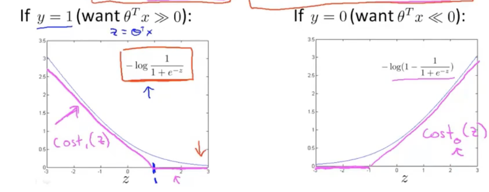
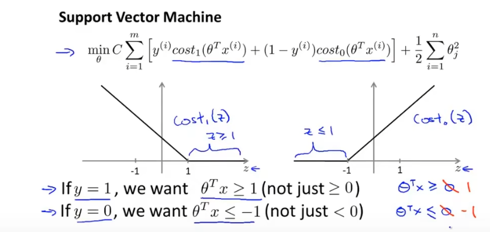
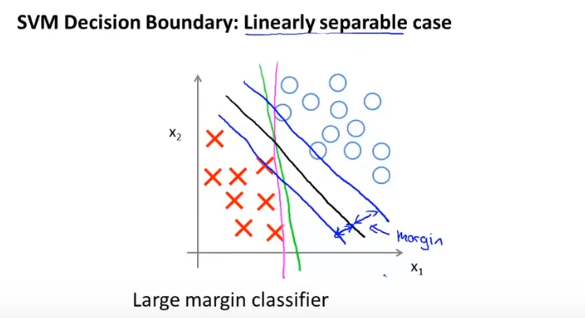

Part I Machine Learning Basis  
# 10.Cost Function(代价函数)  
Model:$f_{w,b}(x)=wx+b$  
w,b:parameters,coefficients,weights  
Squared error cost function:$J(w,b)=\frac{1}{2m}\displaystyle\sum_{i=1}^m(\hat y(i)-y(i))^2$  
# 14.Gradient Descent(梯度下降)  
用来求得可微函数的局部最小值  
Keep changing w,b to reduce J(w,b),until we settle at or near a minimum.  
Simultaneous update:  
$tmp_w=w-\alpha\frac{\partial}{\partial w}J(w,b)$  
$tmp_b=b-\alpha\frac{\partial}{\partial b}J(w,b)$  
$w=tmp_w$  
$b=tmp_b$  
$\alpha:$learning rate,usually a small positive number between 0 and 1.  
The learning rate controls how big a step you take when updating the models parameters w and b. 
# 17.Learning Rate(学习率)  
If the learning rate is too small,then gradient descent will work,but it will be slow.  
If the learning rate is too large,gradient descent may overshoot and may never reach the minimum,  
gradient descent may fail to converge and may even diverge.  
If you're already at the local minimum,gradient descent leaves w unchanged because it just updates  
the new value of w to be the exact same old value of w.  
As we get near a local minimum,gradient descent will automatically take smaller steps,and that's  
because as we approach the local minimum,the derivative automatically gets smaller,and that means  
the update steps also automatically get smaller,even if the learning rate $\alpha$ is kept at some  
fixed value.  
You can use it to try to minimize any cost function J.
# 31.Logistic Regression  
sigmoid function(logistic function)  
$g(z)=\frac{1}{1+e^{-z}}$,0<g(z)<1  
$z\rightarrow \infty,g\rightarrow1$  
$z\rightarrow -\infty,g\rightarrow 0$  
$z=0,g=0.5$  
$f_{\vec w,b}(\vec x)=\frac{1}{1+e^{-(\vec w\cdot \vec x+b)}}$,输出结果在0~1之间  
# 36.The Problem of Overfitting(过拟合问题) 
overfit,high variance  
address overfitting:regularization(正则化)
underfitting(欠拟合),high bias  
generalization(泛化):to make good predictions,even on brand new examples that it has never seen before.  

Part II Advanced Learning Algorithms  
# 2.Demand Prediction  
neural networks(deep learning algorithms)  
If you were to go to the internet and download the parameters of a neural network that  
someone else had trained and whose parameters that posted on the internet,then to use that  
neural network to make predictions would be called inference.   
`layer`:a grouping of neurons which take as input the same or similar features and that in  
turn output a few numbers together.  
`activations values`  
`input layer`,`hidden layer`,`output layer`
`multi-layer perceptron(多层感知器)`  

# 4.Neural network layer  
$w_1^{[1]},第一层第一个参数,上角标表示第几层,下角标表示该层第几个节点$
# 5.More complex neural networks  
By convention,when we say that a neural network has four layers,that includes all  
the hidden layers and the output layer,but wo don't count the input layer.    
Activation value of layer l,unit(neuron) j:
$a_j^{[l]}=g(\vec w_j^{[l]}\cdot \vec a^{[l-1]}+b_j^{[l]})$(j is activation function)  
# 6.Inference:making predictions(forward propagation)  
`forward propagation`  
# 19.Alternatives to the sigmoid activation  
Linear activation function:$g(z)=z$  
Sigmoid activation function:$g(z)=\frac{1}{1+e^{-z}}$  
ReLU activation function:$g(z)=max(0,z)$  
ReLU:Rectified Linear Unit(线性修正单元)  
Softmax activation function  
# 20.Choosing activation functions  
Output Layer:  
When choosing the activation function to use for your output layer,  
usually depending on what is the label Y you are trying to predict,
there'll be one fairly natural choice.   
Binary classification:Sigmoid  activation function  
Regression:  
Linear activation function:y=+/-  
ReLU activation function:y>=0  

Hidden Layer:  
ReLU activation function is by far the most common choice in how neural networks  
are trained by many,many practitioners today.  
With the one exception that you do use a sigmoid activation function in the output  
layer if you have a binary classification problem.  
reason:  
1.ReLU is a bit faster to compute.  
2.ReLu function kind of goes flat only in one part of the graph,  
whereas the sigmoid activation function,it kind of goes flat in  
two places.It goes flat to the left of the graph, and it goes flat  
to the right of the graph. And if you're using gradient descent to train  
a neural network,then when you have a function that is flat in a lot of  
places,gradient descents will be really slow.  
Using the ReLU activation function can cause your neural network to learn  
a bit faster as well.  
# 21.Why do we need activation functions  
如果在隐藏中不用激活函数,神经网络会等价于一个线性回归,失去了意义  
# 23.Softmax  
$a_j=\frac{e^{z_j}}{\displaystyle\sum_{k=1}^Ne^{z_k}}=P(y=j|\vec x)$   
$a_1+a_2+...+a_N=1$  
The softmax regression model is a generalization of logistic regression.  
Crossentropy loss  
$$
    loss(a_1,...,a_N,y)=
    \begin{cases}
    -loga_1 &\text{if y=1}\\ 
    -loga_2 &\text{if y=2}\\
    \quad\quad\quad\quad\vdots\\
    -loga_N &\text{if y=N}\\
    \end{cases}
$$
# 33.Evaluating a model  
`test error`,`training error`  
# 34.Model selection and training/cross validation/test sets  
split your data into three different subsets,which we're going to call the  
training set,the cross-validation set(validation set/dev set),and the test set.  
`Training error`,`Cross validation error`,`Test error`  
If you have to make decisions about your model,such as fitting parameters or choosing  
the model architecture,such as neural network architecture or degree of polynomial if  
you're fitting linear regression,to make all those decisions only using your training  
set and your cross-validation set,and to not look at the test set at all while you're  
still making decisions regarding your learning algorithm.And it's only after you've  
come up with one model,that's your final model,to only then evaluate it on the test set.   
# 47.Error metrics for skewed datasets  
confusion matrix(混淆矩阵):  
$$
\begin{array}{c|c|c}
& \text{Actual 1} & \text{Actual 0}\\
\hline
\text{Predicted 1} & \text{True positive} & \text{False positive}\\
\text{Predicted 0} & \text{False negative} & \text{True negative}\\
\end{array}
$$
$Precision=\frac{True~positive}{predicted~positive}=\frac{TP}{TP+FP}$  
$Recall=\frac{True~positive}{actual~positive}=\frac{TP}{TP+FN}$  
In general,a learning algorithm with either 0 precision or 0 recall is not a  
useful algorithm.  
# 48.Trading off precision and recall  
平衡精确率和召回率    
harmonic mean of P and R(调和平均数):强调较小值  
$F1~score=\frac{1}{\frac{1}{2}(\frac{1}{Precision}+\frac{1}{Recall})}=2\frac{Precision\cdot Recall}{Precision+Recall}$

经典机器学习算法  
# 1.decision tree(决策树)  
分类和回归树(CART)  
ID3算法  
C4.5和C5.0算法  
CHAID算法  
单层决策树  
M5算法  
条件决策树  
# 2.random forests(随机森林)  
# 3.logistic regression(逻辑回归)    

# 4.SVM(支持向量机)  
# 1.Optimization objective  
$h_\theta(x)=\frac{1}{1+e^{-\theta^Tx}}$  
If y=1,we want $h_\theta(x)\approx 1,\theta^Tx\gg0$  
If y=0,we want $h_\theta(x)\approx 0,\theta^Tx\ll0$  
Cost of example:  
$-(ylog h_{\theta}(x)+(1-y)log(1-h_{\theta}(x)))$  
$=-ylog\frac{1}{1+e^{-\theta^Tx}}-(1-y)log(1-\frac{1}{1+e^{-\theta^Tx}})$  
If y=1$(want~\theta^Tx\gg0):-log\frac{1}{1+e^{-z}}$   
If y=0$(want~\theta^Tx\ll0):-log(1-\frac{1}{1+e^{-z}})$  

Logistic regression:  
$\mathop{min}\limits_{\theta}\frac{1}{m}[\sum\limits_{i=1}^my^{(i)}(-logh_{\theta}(x^{(i)}))+(1-y^{(i)})((-log(1-h_{\theta}(x^{(i)})))]+\frac{\lambda}{2m}\sum\limits_{j=1}^n\theta_j^2$  
Support vector machine:  
  
$\mathop{min}\limits_{\theta}C\sum\limits_{i=1}^m[y^{(i)}cost_1(\theta^Tx^{(i)})+(1-y^{(i)})cost_0(\theta^Tx^{(i)})]+\frac{1}{2}\sum\limits_{j=1}^n\theta_j^2$  
Hypothesis:  
$$
h_{\theta}(x)=
\begin{cases}
1 & if~\theta^Tx\gg0\\
0 & otherwise
\end{cases}
$$
# 2.Large Margin Intuition  
 
If y=1,we want $\theta^Tx\geq 1(not~just\geq 0)$  
If y=0,we want $\theta^Tx\leq -1(not~just<0)$  

SVM Decision Boundary:Linearly separable case  

trying to separate the positive and negative examples with as big a margin as possible.  
# 3.The mathematics behind large margin classification  
$\mathop{min}\limits_\theta\frac{1}{2}\sum\limits_{j=1}^n\theta_j^2$  
s.t. $p^{(i)}\cdot||\theta||\geq 1~if~y^{(i)}=1$  
$p^{(i)}\cdot||\theta||\leq-1~if~y^{(i)}=0$  
where $p^{(i)}$ is the projection of $x^{(i)}$ onto the vector $\theta$  
Simplification:$\theta_0=0$  
# 4.Kernels I  
Kernels and Similarity  
$f_1=similarity(x,l^{(1)})=exp(-\frac{||x-l^{(1)}||^2}{2\sigma^2})=exp(-\frac{\sum\limits_{j=1}^n(x_j-l_j^{(1)})^2}{2\sigma^2})$  
$If~x\approx l^{(1)}:f_1\approx 1$  
$If~x~far~from~l^{(1)}:f_1\approx 0$  
我们通过标记点和相似性函数来定义新的特征变量,从而训练复杂的非线性边界  
# 5.Kernels II  
SVM with Kernels  
Hypothesis:  
Give x,compute features $f\in R^{m+1}$  
Predict "y=1" if $\theta^T f\geq 0$  
Training:  
$\mathop{min}\limits_{\theta}C\sum\limits_{i=1}^m y^{(i)}cost_1(\theta^T f^{(i)})+(1-y^{(i)})cost_0(\theta^T f^{(i)})+\frac{1}{2}\sum\limits_{j=1}^n\theta_j^2$ 

C(=$\frac{1}{\lambda}$)  
Larger C:Lower bias,high variance  
Small C:Higher bias,low variance  

$\sigma^2$  
Large $\sigma^2$:Features $f_i$ vary more smoothly.  
Higher bias,lower variance.  
Small $\sigma^2$:Features $f_i$ vary less smoothly.  
Lower bias,higher variance.  
# 6.Using SVM  
非线性函数  

Need to specify:  
Choice of parameter C  
Choice of kernel(similarity function)  

No kernel("linear kernel"):    
Predict "y=1" if $\theta^T x\geq 0$  

Gaussian kernel:  
$f_i=exp(-\frac{||x-l^{(i)}||^2}{2\sigma^2}),where~l^{(i)}=x^{(i)}$  
Need to choose $\sigma^2$  

Do perform feature scaling before using the Gaussian kernel.  

Mercer Theorem  

Logistic regression vs SVMs  
n=number of features,m=number of training examples  
if n is large(relative to m),use logistic regression,or SVM without a kernel.  
if n is small,m is intermediate,use SVM with Gaussian kernel.  
If n is small,m is large:Create/add more features,then use logistic regression  
or SVM without a kernel.  
Neural network likely to work well for most of these settings,but may be slower to train.  

SVM是一种凸优化问题  

# 5.KNN(最临近规则分类)  
# 6.贝叶斯算法  
Naive Bayes(朴素贝叶斯)  
高斯朴素贝叶斯  
多项式朴素贝叶斯  
AODE  
BBN(贝叶斯信念网络)  
BN(贝叶斯网络)  
# 7.Cluster(聚类)  
k-Means  
k-中位数  
EM算法  
分层聚类算法  
# 8.降维算法  
PCA(主成分分析)  
PCR(主成分回归)  
PLSR(偏最小二乘回归)  
萨蒙映射  
MDS(多维尺度分析法)  
PP(投影寻踪法)  
LDA(线性判别分析法)  
MDA(混合判别分析法)  
QDA(二次判别分析法)  
FDA(灵活判别分析法)  
# 9.模型融合算法  
Boosting  
Bagging  
AdaBoost  
GBDT(梯度提升树)  
XGBoost  
堆叠泛化(混合)  
GBM算法  
GBRT算法

其他机器学习算法  
# 1.协同过滤  
# 2.关联规则学习  
Apriori  
Eclat  
# 3.人工神经网络  
perceptron(感知机)  
backpropagation(反向传播)  
Hopfield网络  
RBFN(径向基函数网络)  
# 4.深度学习算法  
DBM(深度玻尔兹曼机)  
DBN(深度信念网络)  
CNN(卷积神经网络)  
Stacked Auto-Encoder(栈式自编码算法)  

