# Part I:Basis 

# 2.Introduction  
Logistic regression algorithms are particularly useful because they are easy to train and provide you with  
a good baseline result.  
# 3.supervised machine learning and sentiment analysis(监督学习和情感分析)  
In supervised machine learning you have input features X and a set of labels Y.  
Your goal is to minimize your error rates or cost as much as possible.  
You're going to run your prediction function which takes in parameters data to  
map your features to output labels $\hat Y$.  
The best mapping from features to labels is achieved when the difference between the 
expected values Y and the predicted values $\hat Y$ is minimized.  
Which the cost function does by comparing how closely your output $\hat Y$ is to your label Y.  
Then you can update your parameters and repeat the whole process until your cost is minimized.  

Sentiment analysis using logistic regression  
1.process the raw tweets in your training sets and extract useful features.  
2.train your logistic regression classifier while minimizing the cost.  
3.make your predictions.  
# 4.how to represent a text as a vector  
Feature extraction  
Problems with sparse representations:  
1.Large training time  
2.Large prediction time  
# 5.Positive and negative frequencies(正负频率)  
Frequency dictionary:which maps a word and the class to the number of times that word showed up in 
the corresponding class.
# 6.Feature extraction using positive and negative frequencies  
Encode a tweet or specifically represented as a vector of dimension 3.  
In doing so,you'll have a much faster speed for your logistic regression classifier.  
freqs:dictionary mapping from(word,class) to frequency  
$X_m=[1,\sum\limits_w freqs(w,1),\sum\limits_w freqs(w,0)]$  
$X_m:$Features of tweet m.  
The first feature would be a bias unit equal to 1.  
The second is the sum of the positive frequencies for every unique word on the tweet.  
The third is the sum of the negative frequencies for every unique word on the tweet.  
# 7.Preprocessing  
stemming(词干提取) and stop words(停用词)  
stemming in NLP:simply transforming any word to its base stem(词干),which you could define as the 
set of characters that are used to construct the word and its derivatives(构造词及其派生词的字符集).  
# 8.Integrate everything  
1.build the frequencies dictionary.  
2.initialize the matrix X to match your number of tweets.  
3.deleting stop words,stemming,deleting URLs,and handles and lower casing.  
4.extract the features by summing up the positive and negative frequencies of the tweets.  
# 9.overview of logistic regression  
$h(x^{(i)},\theta)=\frac{1}{1+e^{-\theta^Tx^{(i)}}}$  
# 10.logistic regression training  
gradient descent.  
1.initialize your parameters vector $\theta$  
2.use the logistic function to get values for each of your observations.  
$h=h(X,\theta)$  
3.calculate the gradients of your cost function and update your parameters  
$\nabla=\frac{1}{m}X^T(h-y)$  
$\theta=\theta-\alpha\nabla$  
4.compute your cost J.  
$J(\theta)$  
# 11.logistic regression testing  
pred=$h(X_{val},\theta)>=0.5$  
$\sum\limits_{i=1}^m\frac{pred^{(i)}==y_{val}^{(i)}}{m}$  
# 12.logistic regression cost function  
$J(\theta)=-\frac{1}{m}\sum\limits_{i=1}^m[y^{(i)}log h(x^{(i)},\theta)+(1-y^{(i)})log(1-h(x^{(i)},\theta))]$  
$-\frac{1}{m}\sum\limits_{i=1}^m:$That indicated that you're going to sum over the cost of each training example.  
$-\frac{1}{m}:$indicating that when combined with the sum,this will be some kind of average.  
$-:$The minus sign ensures that your overall costs will always be a positive number.
# 17.Bayes rule  
$P(X|Y)=P(Y|X)\times \frac{P(X)}{P(Y)}$  
# 18.naïve Bayes  
It's a very good,quick and dirty baseline for many texts classification tasks.  
an example of supervised machine learning.  
It's called naive because this method makes the assumption that the features you're using  
for classification are all independent.  
$\prod\limits_{i=1}^m\frac{P(w_i|pos)}{P(w_i|neg)}$  
This expression is called the Naive Bayes inference condition rule for binary classification(二元分类的朴素贝叶斯推理条件规则).  
# 19.Laplacian smoothing(拉普拉斯平滑)  
a technique you can use to avoid your probabilities being zero.  
$P(w_i|class)=\frac{freq(w_i,class)}{N_{class}}$  
$P(w_i|class)=\frac{freq(w_i,class)+1}{N_{class}+V_{class}}$  
$N_{class}=$frequency of all words in class  
$V_{class}=$number of unique words in class  
# 20.log likelihoods 1  
prior ratio(先验比率):$\frac{P(pos)}{P(neg)}$  
likelihood(似然):$\prod\limits_{i=1}^m\frac{P(w_i|pos)}{P(w_i|neg)}$  
$ratio(w)=\frac{P(w|pos)}{P(w|neg)}$  
$\lambda(w)=log\frac{P(w|pos)}{P(w|neg)}$  
you can use that to reduce the risk of numerical underflow(减少数值下溢的风险).  
朴素贝叶斯分数公式:先验比率*似然  
$t=\frac{P(pos)}{P(neg)}\prod\limits_{i=1}^m\frac{P(w_i|pos)}{P(w_i|neg)}$  
if t>1:positive  
if t<1:negative  
取对数,变成log prior(对数先验)+log likelihood(对数似然)  
$log(\frac{P(pos)}{P(neg)}\prod\limits_{i=1}^m\frac{P(w_i|pos)}{P(w_i|neg)})=log\frac{P(pos)}{P(neg)}+\sum\limits_{i=1}^m log\frac{P(w_i|pos)}{P(w_i|neg)}$
# 21.log likelihoods 2  
$\sum\limits_{i=1}^m log\frac{P(w_i|pos)}{P(w_i|neg)}=\sum\limits_{i=1}^m \lambda(w_i)$  
正值表示推文是正面的,负值表示推文是负面的,0表示推文是中立的   
# 22.train the Naive Bayes classifier  
0.Get or annotate a dataset with positive and negative tweets  
1.Preprocess the tweets:process_tweet(tweet)$\rightarrow [w_1,w_2,w_3,...]$  
Lowercase  
Remove punctuation,urls,names  
Remove stop words  
Stemming  
Tokenize sentences  
2.Compute freq(w,class)  
3.Get P(w|class) P(w|neg) using Laplacian smoothing formula  
4.Get $\lambda(w)$  
$\lambda(w)=log\frac{P(w|pos)}{P(w|neg)}$  
5.Compute log prior=log(P(pos)/P(neg))   
$log prior=log\frac{D_{pos}}{D_{neg}}$  
$D_{pos}=$Number of positive tweets  
$D_{neg}=$Number of negative tweets  
If dataset is balanced,$D_{pos}=D_{neg}$ and log prior=0  
# 23.test the Naive Bayes classifier  
$X_{val},Y_{val}\rightarrow$ Performance on unseen data  
Predict using $\lambda$ and logprior for each new tweet  
Accuracy$\rightarrow\frac{1}{m}\sum\limits_{i=1}^m(pred_i==Y_{val_i})$  
# 24.Application of Naive Bayes  
Sentiment analysis  
Author identification  
Spam filtering  
Information retrieval  
Word disambiguation  
# 25.assumptions underlying the naive bayes method  
Naive Bayes的问题:
Independence:Not true in NLP  
Relative frequency of classes affect the model  
Another issue with naive bayes is that it relies on the distribution of the training data sets.  
# 26.analyze errors  
1.Processing as a source errors  
2.Adversarial attacks(对抗攻击)  
# 29.vector space model  
Vector space models will also allow you to capture dependencies between words(捕获词之间的依赖关系).  
Vector space models are used in information extraction(信息抽取) to answer.  
Vector space models allow you to represent words and documents as vectors,this captures the relative meaning.  
# 30.W/W and W/D design  
Word by Word Design  
The co-occurrence(共现) of two different words is the number of times that they appear in your corpus together  
within a certain word distance k.  
Word by document Design  
You will count the times that words from your vocabulary appear in documents that belong to specific categories.  
# 31.Euclidean distance(欧几里得距离)  
$d(B,A)=\sqrt{(B_1-A_1)^2+(B_2-A_2)^2}$  
Euclidean distance for n-dimensional vectors:  
$d(\vec v,\vec w)=\sqrt{\sum\limits_{i=1}^n(v_i-w_i)^2}\rightarrow Norm of (\vec v-\vec w)(比较的向量之间差异的范数)$

```python
import numpy as np

v=np.array([1,6,8])
w=np.array([0,4,6])
d=np.linalg.norm(v-w)
```
# 32.cosine similarity intuition  
The main advantage of this metric over the Euclidean distance is that it isn't biased by the size difference between the representations.  
# 33.cosine similarity score  
vector norm(向量的范数):$||\vec v||=\sqrt{\sum\limits_{i=1}^n v_i^2}$  
Dot product:$\vec v\cdot\vec w=\sum\limits_{i=1}^n v_i\cdot w_i$  
$cos(\beta)=\frac{\vec v\cdot \vec w}{||\vec v||||\vec w||}$  
$Cosine\propto Similarity$  
Cosine Similarity gives values between 0 and 1  
# 35.visualize and PCA  
PCA:principal components analysis(主成分分析)  
Original Space$\rightarrow$Uncorrelated features$\rightarrow$Dimension reduction  
Visualization to see words relationships in the vector space  
# 36.PCA algorithm  
Eigenvector(特征向量):Uncorrelated features for your data.  
Eigenvalue(特征值):the amount of information retained by each feature.  
The Eigenvectors of the co-variance matrix from your data give directions of uncorrelated features and  
the Eigenvalues are the variants of your data sets in each of those new features.  

Mean Normalize Data:$x_i=\frac{x_i-\mu_{x_i}}{\sigma_{x_i}}$  
Get Covariance Matrix  
Perform SVD(奇异值分解)  
SVD:第一个矩阵包含按列堆叠的特征向量,第二个矩阵在对角线上有特征值  

首先,执行词嵌入矩阵与U矩阵(特征向量矩阵)的前n列之间的点积,n等于你最终想要的维度数量    
$X'=XU[:,0:2]$  
Percentage of Retained Variance=$\frac{\sum\limits_{i=0}^1S_{ii}}{\sum\limits_{j=0}^dS_{jj}}$  

# 40.word vector transformation  
$XR\approx Y$  
Loss=$||XR-Y||_F$  
梯度下降:  
$g=\frac{d}{dR}Loss$ gradient  
$R=R-\alpha g$ update  
$$
\begin{pmatrix}
2 & 2\\
2 & 2\\
\end{pmatrix}
$$  
$||A_F||=\sqrt{2^2+2^2+2^2+2^2}=4$  
Frobenius norm:$||A||_F=\sqrt{\sum_\limits{i=1}^m\sum\limits_{j=1}^n|a_{ij}|^2}$  
实际使用Frobenius norm的平方更容易  
$Loss=||XR-Y||_F^2$  
$g=\frac{d}{dR}Loss=\frac{2}{m}(X^T(XR-Y))$  
# 41.KNN  
K-nearest neighbors,for closest matches  
Hash tables  
# 42.Hash tables and Hash functions   
Create a basic hash table  
```python
def basic_hash_table(value_l,n_buckets):
    def hash_function(value,n_buckets):
        return int(value)%n_buckets  
    hash_table={i:[] for i in range(n_buckets)}
    for value in value_l:
        hash_value=hash_function(value, n_buckets)
        hash_table[hash_value].append(value)
    return hash_table
```
# 43.Locality sensitive hashing(局部敏感哈希)  
Which side of the plane?  
```python
def side_of_plance(P,v):
    dotproduct=np.dot(P,v.T)  
    sign_of_dot_product=np.sign(dotproduct)  
    sign_of_dot_product_scalar=np.asscalar(sign_of_dot_product)  
    return sign_of_dot_product_scalar
```
# 44.Mutiple planes(多平面)  
$sign_i\geq 0\rightarrow h_i=1$  
$sign-i<0\rightarrow h_i=0$  
$hash=\sum_i\limits^H 2^i\times h_i$  
Multiple planes,single hash value  
```python
def hash_multiple_plane(P_l,v):
    hash_value=0
    for i,P in enumerate(P_l):
        sign=side_of_plane(P,v)
        hash_i=1 if sign>=0 else 0
        hash_value+=2**i*hash_i
    return hash_value
```
# 45.approximate nearest neighbors(近似最近邻)  
Make one set of random planes  
```python
num_dimensions=2  #300 in assignment
num_planes=3 #10 in assignment
#创建矩阵
random_planes_matrix=np.random.normal(size=(num_planes,num_dimensions))  
v=np.array([[2,2]])  
def side_of_plane_matrix(P,v):
    dotproduct=np.dot(P,v.T)
    sign_of_dot_product=np.sign(dotproduct)
    return sign_of_dot_product
num_planes_matrix=side_of_plane_matrix(random_planes_matrix,v)
```
locality sensitive hashing allows two compute k nearest neighbors,much faster than naive search.  
# 46.Document Search(文档搜索)  
text can be embedded into vector spaces so that nearest neighbors refer to text with similar meaning.  
找到每个单独单词的词向量,然后将它们相加,所有这些词向量的总和成为一个与词向量具有相同维度的文档向量.  

# Part II:probabilistic models and how to use them to predict word sequences  

# 0.Introduction  
auto-correction(自动纠错)  
web search suggestions(网站搜索建议)  
# 2.overview  
autocorrect  
# 3.autocorrect  
Autocorrect is an application that changes misspelled words into the correct ones.  
How it works?  
1.Identify a misspelled word.  
2.Find strings n edit distance away.  
3.Filter candidates.  
4.Calculate word probabilities.  
# 4.Building the model 1  
```python
if word not in vocab:
    misspelled=True
```
Edit:an operation performed on a string to change it  
Given a string find all possible strings that are n edit distance away using  
Insert(插入)   
Delete(删除)   
Switch(相邻交换)  
Replace(替换)  
# 5.Building the model 2  
Calculate word probabilities  
$P(w)=\frac{C(w)}{V}$  
$P(w):$Probability of word  
$C(w):$Number of times the word appears    
$V:$Total size of the corpus   
选择概率最高的单词作为自动纠错的替换词  
# 6.Minimum Edit Distance(最小编辑距离)  
用于拼写纠正,文档相似度,机器翻译,DNA测序  
# 7.Minimum Edit Distance Algorithm  
$D[i,j]=source[:I]\rightarrow target[:j]$  
# 8.Minimum Edit Distance Algorithm II  
$$
D[i,j]=
min
\begin{cases}
D[i-1,j]+del_cost\\
D[i,j-1]+ins_cost\\
D[i-1,j-1]+
\begin{cases}
rep_cost,if~src[i]\ne tar[j]\\
0,if~src[i]=tar[j]
\end{cases}
\end{cases}
$$
# 9.Minimum Edit Distance Algorithm III  
Levenshtein distance  
Backtrace  
Dynamic programming  
# 12.parts of speech tagging(词性标注)  
part of speech(词性)  
Part of speech(POS) tagging  

Applications of POS tagging  
make assumptions about semantics  
identifying named entities  
coreference resolution(共指消解)  
speech recognition(语音识别)  
# 13.Markov chains(马尔可夫链)  
Markov chains are a type of stochastic model that describes a sequence of possible events.  
使用有向图来表示马尔可夫链  
$Q={q_1,q_2,q_3}$  
# 14.Markov chains and parts of speech tags  
transition probabilities(转移概率)  
Markov property  
transition matrix(转移矩阵)  
在转移矩阵中,每一行中的所有转移概率应加起来为1  
initial state

states:$Q=\left\{q_1,...,q_N\right\}$  
Transition matrix:  
$$
\begin{pmatrix}
a_{1,1} & \cdots & a_{1,N}\\
\vdots & \ddots & \vdots\\
a_{N+1,1} & \cdots & a_{N+1,N}
\end{pmatrix}
$$
# 15.hidden Markov models(隐马尔可夫模型)  
The name Hidden Markov model implies that states are hidden or not directly observable.
emission probabilities(发射概率)  
Emission matrix
$$
B=
\begin{pmatrix}
b_{11} & \cdots & b_{1V}\\
\vdots & \ddots & \vdots\\
b_{N1} & \cdots & b_{NV}
\end{pmatrix}
$$
# 16.computing probabilities(计算概率)  
Transition probabilities  
1.Count occurrences of tag pairs  
$C(t_{i-1},t_i)$  
2.Calculate probabilities using the counts  
$P(t_i|t_{i-1})=\frac{C(t_{i-1},t_i)}{\sum\limits_{j=1}^NC(t_{i-1},t_j)}$  
# 17.populate transition matrix(填充转移矩阵)  
smoothing(平滑)  
$P(t_i|t_{i-1})=\frac{C(t_{i-1},t_i)+\epsilon}{\sum\limits_{j=1}^NC(t_{i-1},t_j)+N*\epsilon}$  
# 18.populate emission matrix(填充发射矩阵)  
$P(w_i|t_i)=\frac{C(t_i,w_i)+\epsilon}{\sum_\limits{j=1}^VC(t_i,w_j)+N*\epsilon}=\frac{C(t_i,w_i)+\epsilon}{C(t_i)+N*\epsilon}$  
N表示标签总数,V表示词表大小  
# 19.Viterbi algorithm(维特比算法)  
1.Initialization step  
2.Forward pass  
3.Backward pass  
# 20.Viterbi Initialization  
C:$c_{i,1}=\pi*b_{i,cindex(w_1)}=a_{1,i}*b_{i,cindex(w_1)}$  
D:$d_{i,1}=0$  
# 21.Viterbi Forward pass  
用类似动态规划的方式实现  
$c_{i,j}=\mathop{max~}\limits_{k}c_{k,j-1}*a_{k,i}*b_{i,cindex(w_j)}$  
$d_{i,j}=\mathop{argmax~}\limits_{k}c_{k,j-1}*a_{k,i}*b_{i,cindex(w_j)}$  
# 22.Viterbi Backward pass  
如何使用概率矩阵  
如何使用它来创建路径以便为每个单词分配词性标签    
在此步骤中检索给定单词序列的最可能的词性标签  
矩阵D表示最可能生成我们序列的隐藏状态序列  
$s=\mathop{argmax~}\limits_ic_{i,K}$  
该索引处的概率是生成给定单词序列的最可能的隐藏状态序列的概率  
使用对数概率:  
$log(c_{i,j})=\mathop{max~}\limits_k log(c_{k,j-1})+log(a_k,i)+log(b_i,cindex(w_j))$  
# 24.Week Introduction  
complete(自动补全)  
# 25.N-grams overview(N元语法概述)  
Create language model(LM) from text corpus to  
Estimate probability of word sequences  
Estimate probability of a word following a sequence of words  
Apply this concept to autocomplete a sentence with most likely suggestions  

Other Applications  
Speech recognition  
Spelling correction  
Augmentative communication(辅助沟通系统)  
# 26.N-gram language models and probabilities  
An N-gram is a sequence of N words.  

Sequence notation:  
$w_1^m=w_1w_2\cdots w_m$  
$w_1^3=w_1w_2w_3$  
$w_{m-2}^m=w_{m-2}w_{m-1}w_m$  

Unigram probability(一元语法概率)  
$P(w)=\frac{C(w)}{m}$  

Bigram probability(二元语法概率)  
$P(y\mid x)=\frac{C(x,y)}{\sum\limits_w C(x,w)}=\frac{C(x,y)}{C(x)}$  

Trigram probability(三元语法概率)  
$P(w_3|w_1^2)=\frac{C(w_1^2w_3)}{C(w_1^2)}$  
$C(w_1^2w_3)=C(w_1w_2w_3)=C(w_1^3)$  

N-gram probability(N元语法概率)  
$P(w_N|w_1^{N-1})=\frac{C(w_1^{N-1}w_N)}{C(w_1^{N-1})}$  
$C(w_1^{N-1}w_N)=C(w_1^N)$
# 27.Probability of a sequence(序列概率)  
Conditional probability and chain rule reminder  
$P(B|A)=\frac{P(A,B)}{P(A)}\Rightarrow P(A,B)=P(A)P(B|A)$  
$P(A,B,C,D)=P(A)P(B|A)P(C|A,B)P(D|A,B,C)$  
Problem:Corpus almost never contains the exact sentence we're interested in or even its longer subsequences.  

Approximation of sequence probability  
$P(tea|the~teacher~drinks)\approx P(tea|drinks)$  
$P(the~teacher~drinks~tea)=P(the)P(teacher|the)P(drinks|teacher)P(tea|drinks)$  
Markov assumption:only last N words matter  
$Bigram:P(w_n|w_1^{n-1})\approx P(w_n|w_{n-1})$  
$N-gram:P(w_n|w_1^{n-1})\approx P(w_n|w_{n-N+1}^{n-1})$  

Entire sentence modeled with bigram:$P(w_1^n)\approx\prod\limits_{i=1}^nP(w_i|w_{i-1})$  
$P(w_1^n)\approx P(w_1)P(w_2|w_1)\cdots P(w_n|w_{n-1})$  
# 28.beginning and the end of a sentence(句子开始与结束)  
Start of sentence token $\langle s\rangle$  
$P(\langle s\rangle ~the~teacher~drinks~tea)\approx P(the|\langle s\rangle)P(teacher|the)P(drinks|teacher)P(tea|drinks)$  
Start of sentence token $\langle s\rangle$ for N-grams  
$P(w_1^n)\approx P(w_1|\langle s\rangle\langle s\rangle)P(w_2|\langle s\rangle w_1)\cdots P(w_n|w_{n-2}w_{n-1})$  

N-gram model:add N-1 start tokens $\langle s\rangle$  

End of sentence token $\langle /s\rangle$  
Corpus:  
$\langle s\rangle yes~no$  
$\langle s\rangle yes~yes$  
$\langle s\rangle no~no$  
$P(\langle s\rangle ~yes~yes)=$
$P(yes|\langle s\rangle)\times P(yes|yes)=$
$\frac{C(\langle s\rangle yes)}{\sum\limits_wC(\langle s\rangle w)}\times$
$\frac{C(yes~yes)}{\sum\limits_wC(yes~w)}=$
$\frac{2}{3}\times\frac{1}{2}=\frac{1}{3}$  
$N-gram\Rightarrow just~one\langle/s\rangle$  
the teacher drinks tea$\Rightarrow\langle s\rangle\langle s\rangle$the teacher drinks tea $\langle /s\rangle$  
# 29.N-gram language model  
$P(w_n|w_{n-N+1}^{n-1})=\frac{C(w_{n-N+1}^{n-1},w_n)}{C(w_{n-N+1}^{n-1})}$  
Count matrix  

Probability matrix  
Divide each cell by its row sum  
$sum(row)=\sum\limits_{m \in V}C(w_{n-N+1}^{n-1},w)=C(w_{n-N+1}^{n-1})$  

probability matrix $\Rightarrow$ language model  
Sentence probability  
Next word prediction  

Sentence probability:  
$\langle s\rangle I~learn\langle /s\rangle$  
$P(sentence)=P(I|\langle /s\rangle)P(learn|I)P(\langle /s\rangle|learn)=1\times 0.5\times 1=0.5$  

Log probability  
$P(w_1^n)\approx\prod\limits_{i=1}^nP(w_i|w_{i-1})$  
All probabilities in calculation $\leq$ 1 and multiplying them brings risk of underflow.  

Generative Language model  
Algorithm:  
1.Choose sentence start  
2.Choose next bigram starting with previous word  
3.Continue until $\langle/s\rangle$ is picked  
# 30.language model evaluation  
perplexity(困惑度):评估语言模型的重要指标  
Test data-split method:Continuous text,Random short sequences  

Perplexity:  
$PP(W)=P(s_1,s_2,\cdots,s_m)^{-\frac{1}{m}}$  
困惑度视为文本复杂性的度量  
Smaller perplexity=better model  
好的语言模型的困惑度分数在20到60之间  

Perplexity for bigram models  
$PP(W)=\sqrt[m]{\prod\limits_{i=1}^m\prod\limits_{j=1}^{|s_i|}\frac{1}{P(w_j^{(i)}|w_{j-1}^{(i)})}},w_j^{(i)}\rightarrow$ j-th word in i-th sentence  
concatenate all sentences in W  
$PP(W)=\sqrt[m]{\prod\limits_{i=1}^m\frac{1}{P(w_i|w_{i-1})}},w_i\rightarrow$ i-th word in test set  

Log perplexity  
$logPP(W)=-\frac{1}{m}\sum\limits_{i=1}^mlog_2(P(w_i|w_{i-1}))$  
# 31.Out of vocabulary words(词汇外单词)  
开放词汇简单意味着可能会遇到词汇表外的单词  
Unknown word=Out of vocabulary word(OOV)  
special tag <UNK> in corpus and in input  

Using <UNK> in corpus  
Create vocabulary V  
Replace any word in corpus and not in V by <UNK>  
Count the probabilities with <UNK> as with any other word  

How to create vocabulary V  
Criteria:  
Min word frequency f  
Max |V|,include words by frequency  

Use <UNK> sparingly  

Perplexity-only compare LMs with the same V  
# 32.smoothing  
Missing N-grams in training corpus  
Add-one smoothing(Laplacian smoothing)  
$P(w_n|w_{n-1})=\frac{C(w_{n-1,w_n})+1}{\sum_{w\in V}(C(w_{n-1},w)+1)}=\frac{C(w_{n-1},w_n)+1}{C(w_{n-1})+V}$  
Add-k smoothing  
$P(w_n|w_{n-1})=\frac{C(w_{n-1,w_n})+k}{\sum_{w\in V}(C(w_{n-1},w)+k)}=\frac{C(w_{n-1},w_n)+k}{C(w_{n-1})+k*V}$  

backoff(回退)  
If N-gram missing$\Rightarrow$ use (N-1)-gram  
Probability discounting  
"Stupid" backoff,在N-1元语法前乘上一个常数  

Linear interpolation(线性插值)  
$\hat P(w_n|w_{n-2}w_{n-1})=\lambda_1\times P(w_n|w_{n-2}w_{n-1})+\lambda_2\times P(w_n|w_{n-1})+\lambda_3\times P(w_n)$  
$\sum\limits_i \lambda_i=1$  
$\lambda$是从语料库的验证部分学习的,可以通过最大化验证集中句子的概率来获得它们  
使用从语料库训练部分训练的固定语言模型来计算N元语法概率并优化$\lambda$值  

# 36.Overview
word vectors/word embeddings  
创建词嵌入的多种方法:  
CBOW(continuous bag-of-words,连续词袋模型)  
GloVe  
Word2Vec  
# 37.basic representations of words
One-hot vectors(独热向量):向量长度等于词汇表大小,对应词汇下标的位置为1,其他位置全为0  
优点:简单,不包含隐含顺序信息  
缺点:Huge vectors,No embedded meaning  
# 38.word embedding  
word embedding的特点:low dimension,embed meaning  
# 39.Word embedding process  
Corpus+Embedding method  

Corpus:words in context  
Embedding method:machine learning method,self-supervised(自监督学习,等于unsupervised+supervised)  
Hyperparameters:word embedding size  
Transformation:words to integers/vectors  

# 40.Basic word embedding methods  
word2vec:use a shallow neural network to learn word embeddings  
CBOW(continuous bag-of-words,连续词袋模型):学习预测给定周围单词的缺失单词  
Continuous skip-gram(连续跳字模型)/Skip-gram with negative sampling(SGNG,带负采样的跳字模型)  
学习预测给定输入单词的周围单词  

Global Vectors(GloVe):涉及分解语料库词共现矩阵的对数  

fastText:基于跳字模型,并通过将单词表示为字符的n-gram来考虑单词的结构,使模型能够支持外部词汇单词(out-of-vocabulary words,OOV words)  

Advanced word embedding models:  

Tunable pre-trained models available  
Deep learning,contextual embeddings  
BERT(Bidirectional Encoder Representations),BERT只使用transformer中的encoder  
ELMo(embeddings from language models)  
GPT-2(generative pretraining 2)  

# 41.Continuous bag-of-words model  
context words,center word  
hyperparameter:context half-size  
window:center word plus the context words  
context words as inputs,center word as outputs  

# 42.cleaning and tokenization(清洗与分词)  
Letter case,Punctuation,Numbers,Special characters,Special words  
tokenize:把一段文本拆分成一个个token(单词,字符,字词,标点等等)  
```python
import nltk
from nltk.tokenize import word_tokenize
import emoji

nltk.download('punkt')
corpus='Who ❤️ "word embeddings" in 2020? I do!!!'
#分词前的清洗
data=re.sub(r'[,!?;-]+','.',corpus)
data=nltk.word_tokenize(data) #tokenize string to words
data=[ch.lower() for ch in data 
      if ch.isalpha()
      or ch=='.'
      or emoji.get_emoji_regexp().search(ch)
      ]
```
# 43.sliding window of words in python  
```python
#words:token数组,C:上下文半径
def get_windows(words,C):
    i=C
    while i<len(words)-C:
        center_word=words[i]
        context_words=words[(i-C):i]+words[(i+1):(i+C+1)]
        #yield是生成器函数,可以多次返回
        yield context_words,center_word
        i+=1

for x,y in get_windows(
    ['i','am','happy','because','i','am','learning'],
    2
        ):
    print(f'{x}\t{y}')
```
# 44.Transforming Words into Vectors  
对于center word,使用one-hot vector将其转化为向量  
对于context words,使用on-hot vectors的平均值将其转化为向量  

# 45.Architecture of the CBOW model  
使用一个浅层神经全连接神经网络,包含三层:输入,隐藏,输出,其训练结果的副产品(权重)就是我们想要的词嵌入向量  
a shallow dense neural network with an input layer,a single hidden layer,and an output layer.  
Hidden layer activation function:ReLU  
Output layer activation function:softmax  

# 46.Architecture of the CBOW Model:Dimensions  
Input layer:$x(V\times 1)$  
$z_1=W_1x+b_1,W_1(N\times V),b_1(N\times 1)$  
$h=ReLU(z_1)$
Hidden layer:$h(N\times 1)$  
$z_2=W_2h+b_2$  
$W_2(V\times N),b_2(V\times 1)$  
$\hat y=softmax(z_2)$  
Output layer:$\hat y(V\times 1)$  

Column vectors  
$z_1=W_1x+b_1$  
$z_1(N\times 1),W_1(N\times V),x(V\times 1),b_1(N\times 1)$  
Row vectors  
$z_1=xW_1^T+b_1$  
$z_1(1\times N),W_1(N\times V),x(1\times V),b_1(1\times N)$  

# 47.Architecture of the CBOW Model:Dimensions 2  
将多个例子同时输入神经网络被称为批处理  

Dimensions(batch input)  
Input layer:$X(V\times m)$  
m:batch size(批量大小),超参数    
$Z_1=W_1X+B_1$  
$W_1(N\times V),B_1(N\times m)$  
$Z_1=W_1X+B_1(N\times m)$
$H=ReLU(Z_1)(N\times m)$  
Hidden layer:$H(N\times m)$  
N:word embedding size,hyperparameter  
$Z_2=W_2H+B_2(V\times m)$  
$W_2(V\times N),B_2(V\times m)$  
$\hat Y=softmax(Z_2)(V\times m)$  
Output layer:$\hat Y(V\times m)$  

# 49.CBOW model cost function  training  
cross entropy loss function is often used with classification models which often go hand in hand with  
the softmax output player in your own networks.  
$J=-\sum\limits_{k=1}^Vy_klog\hat y_k$  
$J=-log\hat y_{actual word}$  

# 50.Training a CBOW Model:forward propagation  
Training process  
Forward propagation  
Cost  
Backpropagation and gradient descent  

Cost
cost:mean of losses  
$J_{batch}=-\frac{1}{m}\sum\limits_{i=1}^m\sum\limits_{j=1}^Vy_j^{(i)}log\hat y_j^{(i)}$  
$J_{batch}=\frac{1}{m}\sum\limits_{i=1}^mJ^{(i)}$  

# 51.Training a CBOW Model:backpropagation and gradient descent  
Backpropagation:calculate partial derivatives of cost with respect to weights and biases  
gradient descent:update weights and biases  

Backpropagation  
$\frac{\partial J_{batch}}{\partial W_1}=\frac{1}{m}(W_2^T(\hat Y-Y)\cdot step(Z_1))X^T$  
$\frac{\partial J_{batch}}{\partial W_2}=\frac{1}{m}(\hat Y-Y)H^T$  
$\frac{\partial J_{batch}}{\partial b_1}=\frac{1}{m}(W_2^T(\hat Y-Y)\cdot step(Z_1))1_m^T$  
$\frac{\partial J_{batch}}{\partial b_2}=\frac{1}{m}(\hat Y-Y)1_m^T$  
$1_m^T$:一个包含m个元素的列向量,所有元素都是1  
```python
import numpy as np
np.sum(a,axis=1,keepdims=True)
```

Gradient descent  
Hyperparameter:learning rate $\alpha$  
$W_1:=W_1-\alpha\frac{\partial J_{batch}}{\partial W_1}$  
$W_2:=W_2-\alpha\frac{\partial J_{batch}}{\partial W_2}$  
$b_1:=b_1-\alpha\frac{\partial J_{batch}}{\partial b_1}$  
$b_2:=b_2-\alpha\frac{\partial J_{batch}}{\partial b_2}$  

# 52.Extracting Word Embedding Vectors  
在反向传播结束之后,从两个权重矩阵的平均值中提取出词嵌入向量  
两个权重矩阵分别为输入到隐藏层,隐藏到输出层  
$W_3=0.5(W_1+W_2^T),N\times V$,第j列对应输入的第j个token  

# 53.Evaluating Word Embeddings:intrinsic evaluation(内在评估)  
内在评估方法评估词嵌入如何内在地捕捉词语之间的语义或句法关系  
语义指的是词语的含义,而句法指的是语法  
clustering,analogies,visualization(聚类,类比,可视化)  
# 54.Evaluating Word Embeddings:extrinsic evaluation(外在评估)  
Test word embeddings on external task  

NLP and machine learning libraries  
在相关深度学习框架中,embedding可以通过调用API实现,其内部原理是使用反向传播,然后从权重矩阵中提取出词向量   
```python
#Keras
#第一个参数V代表词汇表大小,第二个参数m代表想要得到的向量维度,是自定义的超参数
embed_layer=Embedding(10000,400)
#PyTorch
embed_layer=nn.Embedding(10000,400)
```

# Part III:NLP with sequence models  

# 2.neural network of sentiment analysis(用于情感分析的神经网络)  
padding(填充)  
# 3.Dense layer and ReLU  
Dot product,Non-Linear Function  
# 4.Embedding and mean layers(嵌入和均值层)  
embedding layer:map words to embeddings  
learn a matrix:$Vocabulary\times Embedding$  
size of embedding:hyperparameter  

mean layer:compute the mean of the word embeddings  

# 6.traditional language model  
传统语言模型如N-gram的局限性:  
1.需要考虑长词序列中的条件概率,如果没有相应大的语料库,这可能很难估计  
2.模型需要大量的空间和内存来存储所有可能组合的概率

# 7.RNN  
NLP发展:传统语言模型(N-gram)$\Rightarrow$RNN$\Rightarrow$Transformer  
RNN的问题:对于长序列会产生梯度消失  
transformer解决了这点  

A plain RNN propagates information from the beginning of the sentence through to the end.  
序列中每个词的信息都乘以相同的权重下标$W_x$  
从开头到结尾传播的信息乘以$W_h$  
这个块对序列中的每个词都重复一次,唯一可学习的参数是$W_x,W_h,W$  
它们计算的值会一遍又一遍地反馈给自己,直到做出预测,因此叫"循环"神经网络  

RNN的优势:  
propagate information within sequences and your computation's share most of the parameters  

# 8.RNN application  
One to One:一个输入,一个输出,如球队得分预测     
One to Many:一个输入,多个输出,如图片描述  
Many to One:多个输入,一个输出,如情感分析  
Many to Many:多个输入,多个输出,如机器翻译

encoder:将序列编码为单一表示,不输出  
decoder:输出  

RNN可以用于机器翻译和字幕生成  
# 9.math behind RNN  
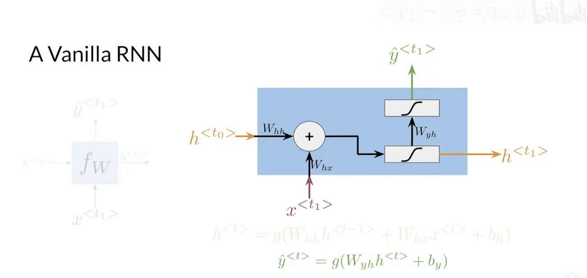  
hidden state:$h^{\langle t\rangle}=g(W_h[h^{\langle t-1\rangle},x^{\langle t\rangle}]+b_h)=g(W_{hh}h^{\langle t-1\rangle}+W_{hx}x^{\langle t\rangle}+b_h)$    
output:$\hat y^{\langle t\rangle}=g(W_{yh}h^{\langle t\rangle}+b_y)$  

Hidden states propagate information through time  
Basic recurrent units have two inputs at each time:$h^{\langle t-1\rangle},x^{\langle t\rangle}$  

# 10.cost function for RNN  
Cross Entropy Loss(交叉熵损失):$J=-\sum\limits_{j=1}^Ky_jlog\hat y_j$,K:number of classes or possibilities  

Average with respect to time:$J=-\frac{1}{T}\sum\limits_{t=1}^T\sum\limits_{j=1}^Ky_j^{\langle t\rangle}log\hat y_j^{\langle t\rangle}$  

# 11.Implement RNN   
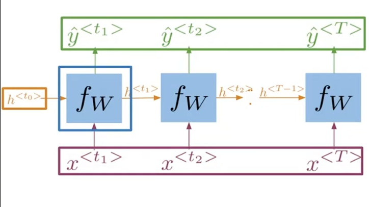
```python
#tf.scan()function  
#fn等同于fw,即RNN单元,elems是包含所有输入的列表,initializer是初始隐藏状态  
def scan(fn,elems,initializer=None,...):
    cur_value=initializer #当前隐藏状态ht
    ys=[] #输出列表
    for x in elems:
        y,cur_value=fn(x,cur_value) #更新当前时间的输出和对应的隐藏状态
        ys.append(y)
    return y,cur_value #返回预测列表和最后一个隐藏状态

```
Frameworks like Tensorflow need this type of abstraction  
Parallel computations and GPU usage  
# 12.Gated recurrent unit(GRU,门控循环单元)  
标准RNN在处理长序列单词时,信息往往会消失  
GRU可以处理长序列  

GRU学会了在隐藏状态中保留关于主语的信息  

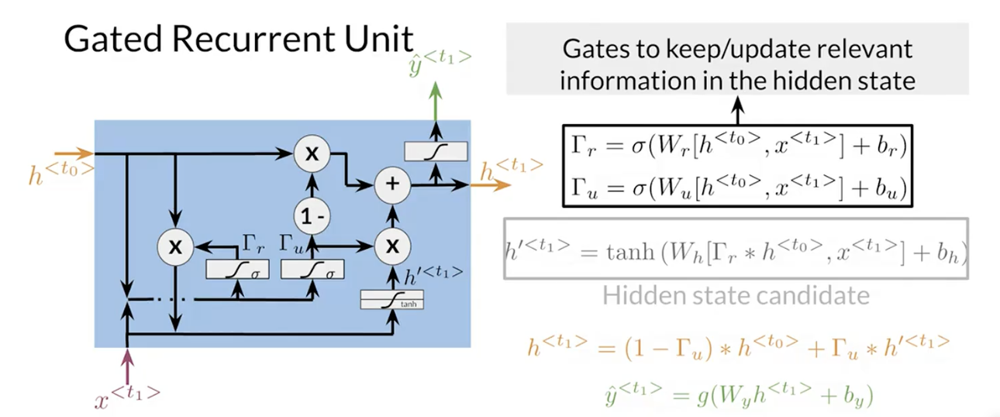
Compute relevance and update gates to remember important prior information  
relevance gate(相关门):$\Gamma_r=\sigma(W_r[h^{\langle t_0\rangle},x^{\langle t_1\rangle}]+b_r)$  
update gate(更新门):$\Gamma_u=\sigma(W_u[h^{\langle t_0\rangle},x^{\langle t_1\rangle}]+b_u)$  

Their outputs help determine which information from the previous hidden states is relevant and  
which value should be updated with current information.  

candidate hidden state:$h'^{\langle t_1\rangle}=tanh(W_h[\Gamma_r*h^{\langle t_0\rangle},x^{\langle t_1\rangle}]+b_h)$  
This value stores all the candidates for information thus could override the one contained in the  
previous hidden states.  

$h^{\langle t_1\rangle}=(1-\Gamma_u)*h^{\langle t_0\rangle}+\Gamma_u*h'^{\langle t_1\rangle}$  
The updates gate determines how much of the information from the previous hidden state will be overwritten.  

$\hat y^{\langle t1\rangle}=g(W_yh^{\langle t_1\rangle}+b_y)$  

Vanilla RNN and GRU:
Vanilla RNN is updating the hidden state at every time step,  
for long sequences,the information tends to vanish.
GRUs compute significantly more operations,which can cause longer  
processing times and memory usage.  
所有这些计算允许网络学习要保留哪些类型的信息以及何时覆盖它.  

GRUs "decide" how to update the hidden state.  
GRUs help preserve important information.  

GRUs are simplified versions of LSTMs.  
# 13.BRNN and DRNN  
Deep recurrent neural networks are useful because they allow you to capture  
dependencies that you could not have otherwise captured using shallow RNNs.  

Bi-directional RNNs(双向RNN)   
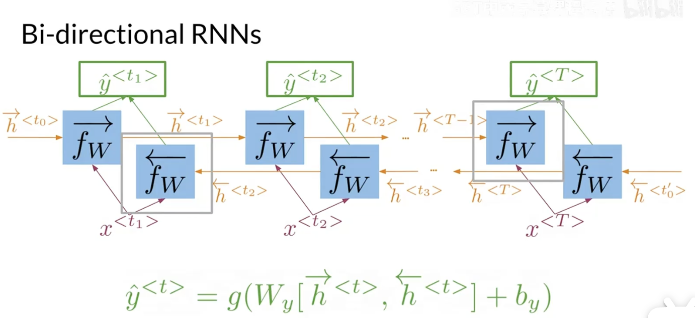  
$\hat y^{\langle t\rangle}=g(W_y[\overrightarrow{h^{\langle t\rangle}},\overleftarrow{h^{\langle t\rangle}}] + b_y)$  
Information flows from the past and from the future independently.   

Deep RNNs  
deep RNNs are just RNNs stack together.  
The intermediate connections pass information through the values of activations.  
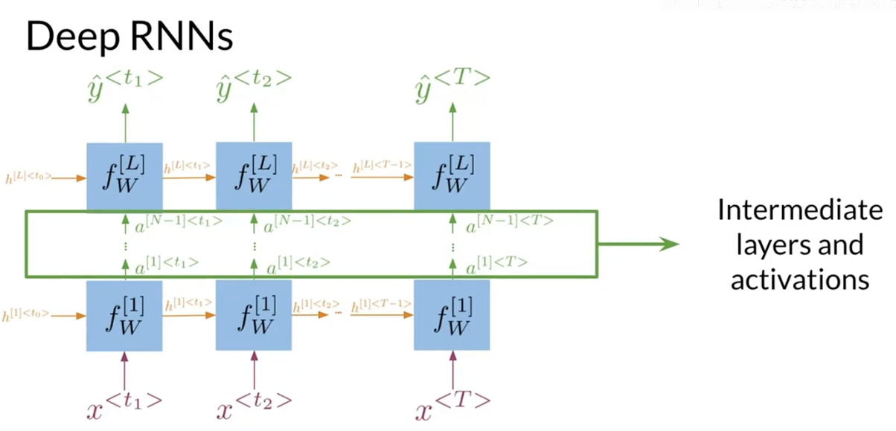   
$h^{[l]\langle t\rangle}=f^{[l]}(W_h^{[l]}[h^{[l]\langle t-1\rangle},a^{[l-1]\langle t\rangle}]+b_h^{[l]})$  
$a^{[l]\langle t\rangle}=f^{[l]}(W_a^{[l]}h^{[l]\langle t\rangle}+b_a^{[l]})$  

1.Get hidden states for current layer  
2.Pass the activations to the next layer  

In bidirectional RNNs,the outputs take information from the past and the future.  
Deep RNNs have more than one layer,which helps in complex tasks.  

# 16.RNN and gradient vanishing(RNN和梯度消失)  
RNNs:Advantages  
Captures dependencies within a short range  
Takes up less RAM than other n-gram models  

RNNs:Disadvantages  
Struggles to capture long term dependencies  
Prone to vanishing or exploding gradients  

Backpropagation through time  
$\frac{\partial L}{\partial W_h}\propto\sum\limits_{1\leq k\leq t}(\prod\limits_{t\geq i\geq k}\frac{\partial h_i}{\partial h_{i-1}})\frac{\partial h_k}{\partial W_h}$  
$(\prod\limits_{t\geq i\geq k}\frac{\partial h_i}{\partial h_{i-1}})\frac{\partial h_k}{\partial W_h}\rightarrow$Contribution of hidden state k  
$\prod\limits_{t\geq i\geq k}\frac{\partial h_i}{\partial h_{i-1}}\rightarrow$Length of the product proportional to how far k is from t  

Partial derivatives<1  
Contribution goes to 0  
Vanishing Gradient:It causes RNN to ignore the values computed at early steps of a sequence.  

Partial derivatives>1  
Contribution goes to infinity  
Exploding Gradient:It causes convergence problems during training.  

Solving for vanishing or exploding gradients  

Identity RNN(单位RNN):
只能解决梯度消失   
Initialize weights to the identity matrix(单位矩阵),using ReLU activation function.  
This has the effect of encouraging network to stay close to the values of identity matrix,  
which act like ones during matrix multiplication.  

Gradient clipping(梯度裁剪):  
解决梯度爆炸  
simply choose a relevant value x that you would clip the gradient to.  
Any value greater than x will be clipped to x.  

Skip connections(跳跃连接):  
activations from early layers have more influence over the costs.  

# 17.LSTM(Long short-term memory unit,长短记忆单元) overview  
LSTMs offer a solution to vanishing gradients  
Learn when to remember and when to forget.  
Basic anatomy:  
A cell state  
A hidden state  
Multiple gates  

Gates allow gradients to avoid vanishing and exploding  

Cell and Hidden States:Starting point with some irrelevant information

Gates in LSTM:  
1.Forget Gate:information that is no longer important  
2.Input Gate:information to be stored  
3.Output Gate:information to use at current step  

Applications of LSTMs:  
Next-character prediction  
Chatbots  
Music composition  
Image captioning  
Speech recognition   

# 18.LSTM architecture  
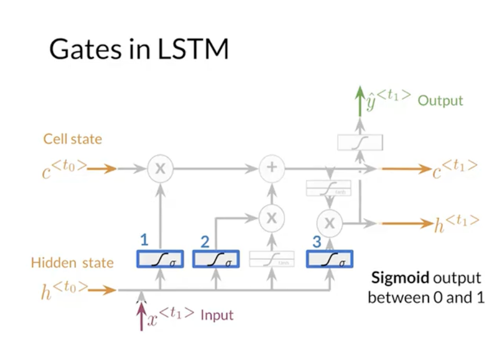  
Candidate cell state:$\tilde c{\langle t_1\rangle}=tanh(W_c[h^{\langle t_0\rangle},x^{\langle t_1\rangle}]+b_c)$  
Forget gate:$F_f=\sigma(W_f[h^{\langle t_0\rangle},x^{\langle t_1\rangle}]+b_f)$  
Input gate:$F_i=\sigma(W_i[h^{\langle t_0\rangle},x^{\langle t_1\rangle}]+b_i)$  
Output gate:$F_o=\sigma(W_o[h^{\langle t_0\rangle},x^{\langle t_1\rangle}]+b_o)$  
New cell state:$c^{\langle t_1\rangle}=F_f*c^{\langle t_0\rangle}+F_i*\tilde c^{\langle t_1\rangle}$  
New Hidden state:$h^{\langle t_1\rangle}=F_o*tanh(c^{\langle t_1\rangle})$   
Output:$\hat y^{\langle t_1\rangle}=g(W_yh^{\langle t_1\rangle}+b_y)$  

Candidate cell state:  
Information from the previous hidden state and current input.  
New Cell state:  
Add information from the candidate cell state using the forget and input gates.  
New Hidden State:  
Select information from the new cell state using the output gate.  

LSTMs use a series of gates to decide which information to keep:  
Forget gate decides what to keep  
Input gate decides what to add   
Output gate decides what the next hidden state will be  
# 19.named entity recognition(NER,命名实体识别) overview  
Locates and extracts predefined entities from text  
Applications of NER systems  
Search engine efficiency  
Recommendation engines  
Customer service  
Automatic trading  
# 20.Processing data for NERs  
Assign each class a number  
Assign each word a number  

Token padding  
For LSTMs,all sequences need to be the same size.  
Set sequence length to a certain number.  
Use the $\langle PAD\rangle$ token to fill empty spaces.  

Training the NER:  
1.Create a tensor for each input and its corresponding number  
2.Put them in a batch  
3.Feed it into an LSTM unit  
4.Run the output through a dense layer  
5.Predict using a log softmax over K classes  

LogSoftmax gives better numerical performance and gradient optimization.  
```python
#Layers in TensorFlow
model=tf.keras.Sequential([
    tf.keras.layers.Embedding(),
    tf.keras.layers.LSTM(),
    tf.keras.layers.Dense(),
])
```
# 21.Evaluating the model  
1.Pass test set through the model  
2.Get arg max across the prediction array   
3.Mask padded tokens  
4.Compare outputs against test labels  

```python
def masked_accuracy(y_true,y_pred):
    #Identify any token IDS you need to skip over during evaluation
    #One token you might want to skip is your pad token
    mask=...
    y_pred_class=tf.math.argmax(y_pred,axis=-1)
    matches_true_pred=tf.equal(y_true,y_pred_class)
    matches_true_pred*=mask
    masked_acc=tf.reduce_sum(acc)/tf.reduce_sum(mask)
    return masked_acc
```

# 24.Siamese network(孪生网络)  
It is a neural network made up of two identical neural networks which are merged at the end.  

Siamese Networks in NLP  
Handwritten checks  
Question duplicates  
Queries  

# 25.Architecture(架构)  
Siamese networks have two identical subnetworks which are merged together to produce a final  
output or a similarity score.  

The subnetworks share identical parameters,the learned parameters of each subnetwork are exactly the same.  
You actually only need to train one set of weights,not two.  

$\tau$:how often you want to interpret cosine similarity to indicate that two questions are similar or not.   
A higher threshold means that only very similar sentences will be considered similar.  

$\hat y\leq\tau:different$  
$\hat y>\tau:same$  

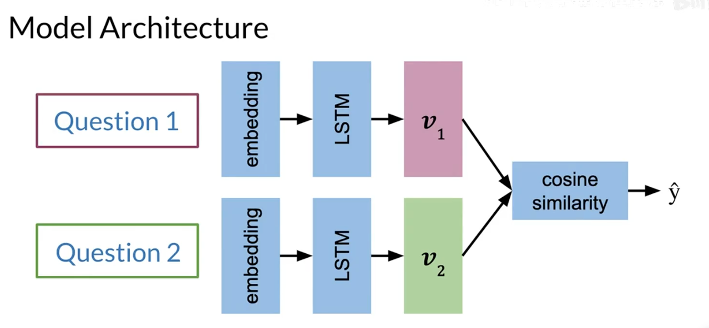  
1.Inputs  
2.Embedding  
3.LSTM  
4.Vectors  
5.Cosine Similarity  

# 26.cost function  
anchor  
Other questions that have the same meaning as the anchor are called positive questions.  
Questions do not have the same meaning as the anchor are called negative questions.  

$cos(v_1,v_2)/s(v_1,v_2)=\frac{v_1\cdot v_2}{||v_1||||v_2||}$  
$s(A,P)\approx 1$  
$s(A,N)\approx -1$  
$diff=s(A,N)-s(A,P)$   
loss和diff成正比  
注意s表示的是余弦相似度,值在-1~1之间波动,越相似,越接近1,越不相似,越接近-1   

# 27.triplets(三元组)  
triplets:groups of Anchor,Positive and Negative  
triplet loss is the name for a loss function that uses these components  

Triplet Loss  
$$
\mathcal L=
\begin{cases}  
0 & if~diff+\alpha\leq 0\\
diff+\alpha & if~diff+\alpha>0  
\end{cases}  
$$  
$\mathcal L(A,P,N)=max(diff+\alpha,0)$  

如果你选择对模型构成挑战的三元组,你可以更高效地进行训练  
hard triplets:$s(A,N)\approx s(A,P)$  
# 28.computing the cost I  
$\mathcal L(A,P,N)=max(diff+\alpha,0)$  
$diff=s(A,N)-s(A,P)$  
$J=\sum\limits_{i=1}^m\mathcal L(A^{(i)},P^{(i)},N^{(i)})$  

You only need to have two similar texts which you put on the diagonals,and you use  
the off-diagonals as the non-similar examples.  
# 29.computing the cost II  
Hard Negative Mining  
mean negative:  
mean of off-diagonal values in each row.  
closest negative:  
off-diagonal value closest to(but less than) the value on diagonal in each row.   

$\mathcal L_{Original}=max(s(A,N)-s(A,P)+\alpha,0)$  
mean negative helps the model converge faster during training by reducing noise.  
$\mathcal L_1=max(mean\text{_}neg-s(A,P)+\alpha,0)$  
closest negative helps create a slightly larger penalty by diminishing the effects of the  
otherwise more negative similarity of A and N that it replaces.  
$\mathcal L_2=max(closest\text{_}neg-s(A,P)+\alpha,0)$  
$\mathcal L_{full}=\mathcal L_1+\mathcal L_2$  
$J=\sum\limits_{i=1}^m\mathcal L_{Full}(A^{(i)},P^{(i)},N^{(i)})$  
# 30.One Shot Learning(一次性学习)  
Measure similarity between 2 classes.  

Learn a similarity score  
$s(sig_1,sig_2)>\tau$,same  
$s(sig_1,sig_2)\leq\tau$,different  
$s(sig_1,sig_2)\leq\tau$,different  

# 31.training and test  
Testing  
1.Convert each input into an array of numbers  
2.Feed arrays into your model  
3.Compare $v_1,v_2$ using cosine similarity  
4.Test against a threshold $\tau$
# Part IV:NLP with attention models  

# 1.Week Introduction  
Using a recurrent neural network with LSTMs can work for short to medium length sentences.  
But can result in vanish ingredients for very long sequences.  
To solve this,you will be adding an attention mechanism to allow the decoder to access all relevant parts  
of the input sentence regardless of its length.  
# 2.Seq2Seq(序列到序列)  
Neural Machine Translation  

Introduced by Google in 2014  
Maps variable-length sequences to fixed-length memory  
Inputs and outputs can have different lengths  
LSTMs and GRUs to avoid vanishing and exploding gradient problems  
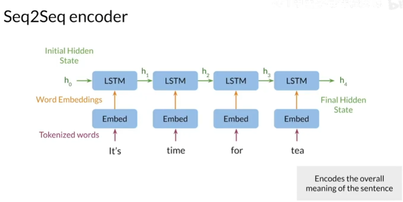
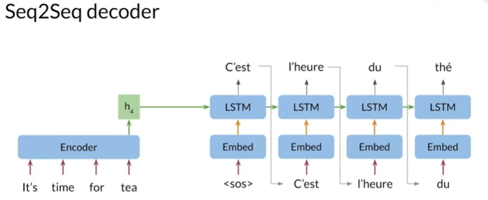

The information bottleneck  
A fixed amount of information goes from the encoder to the decoder.  

Seq2Seq shortcomings:  
Variable-length sentences+fixed-length memory=As sequence size increases,model performance decreases.  

# 3.Seq2Seq model with attention  
The goal of the attention layer is to return a context vector that contains the relevant information  
from the encoder states.  
The first step is to calculate the alignments(对齐分数) $e_{ij}=a(s_{i-1},h_j)$,which is a score of how  
well the inputs j match the expected outputs i.
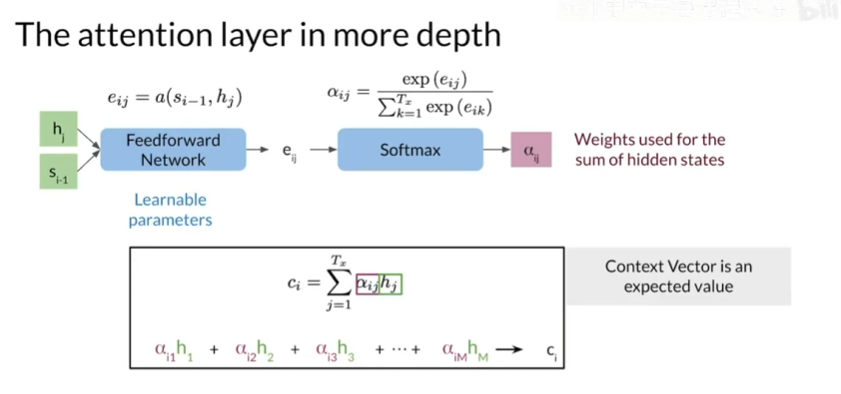

# 4.Queries,keys,values and attention  
You can think of keys and values as a look up table(查找表).   
The query is matched to a key and the value associated with that key is returned.  
查询,键,值都由向量表示  
The similarity between words is called alignment(对齐).  
The query and key vectors are used to calculate alignment scores that are measured  
of how well the query and keys match.  
These alignment scores are then turned into weights used for a weighted sum(加权和) of the value vectors. 
This weighted sum of the value vectors is returned as the attention vector.  

Scaled dot-product attention(缩放点积注意力)  
$softmax(\frac{QK^T}{\sqrt{d_k}})V$  
每个步骤的查询被打包到一个矩阵Q中,因此可以同时为每个查询计算注意力  
键和值被打包到矩阵K和V中,这些矩阵是注意力函数的输入  
首先,查询和键矩阵相乘,得到一个对齐矩阵  
然后,这些对齐矩阵按键向量维度的平方根$d_k$进行缩放  
缩放提高了较大模型尺寸的模型性能,可以视为正则化常数  
接下来,使用softmax函数将缩放后的分数转化为权重,使得每个查询的权重总和为1  
最后,权重和值矩阵相乘,得到每个查询的注意力向量,可以将键和值视为相同  
因此,当将softmax输出与V相乘时,你正在对初始输入进行线性组合,然后将其输入到解码器中  
缩放点积注意力仅包含两个矩阵乘法,没有神经网络  
通常,对齐在学习输入嵌入或注意力层之前的其他线性层中进行  

对齐权重  
对齐权重形成一个矩阵,查询,目标词在行上,键,源词在列上  
这个矩阵中的每个条目都是对应查询,键对的权重  
Word pairs that have similar meanings,K and T,for example,  
will have larger weights than the similar words like day and time.  
通过训练,模型学习哪些词具有相似的意义,并将这些信息编码到查询和键向量中  

注意力机制同时查看整个输入和目标句子,并基于词对计算对齐.因此无论词序如何,都会适当分配权重  

# 5.Machine translation setup  
Use pre-trained vector embeddings  
Initially represent words with one-hot vectors  
Keep track of index mappings with word2ind(word to index) and ind2word dictionaries  
Add end of sequence tokens:$\langle EOS\rangle$   
Pad the token vectors with zeros  
# 6.teacher forcing(教师强制)  
NMT(neural machine translation,神经机器翻译)  
Errors from early steps propagate  
Use the ground truth words as decoder inputs instead of the decoder outputs.  
即使模型做出了错误的预测,它也会假装做出了正确的预测  
Improves training performance
课程学习:可以逐渐开始使用解码器的输出,随着训练的进行,不再输入目标词  
# 7.NMT model with attention  
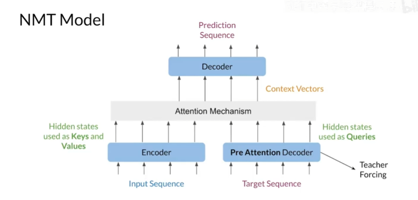
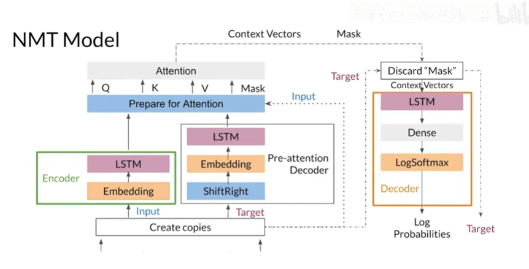
# 8.BLEU(Bilingual Evaluation Understudy) Score  
BLEU is an algorithm designed to evaluate some of the most challenging problems in NLP,including machine translation.  
Compares candidate translations to reference(human) translations.  
The closer to 1,the better.  

BLEU score  
You count how many words from the candidate appear in any of the reference and divide that count by  
the total number of words in the candidate translation.  

BLEU doesn't consider semantic meaning  
BLEU doesn't consider sentence structure  
# 9.ROUGE(Recall-Oriented Understudy of Gisting Evaluation,面向召回的评估替补)-N score  
ROUGE面向召回(recall)  
ROUGE关注的是人类创建的参考文献中有多少出现在候选翻译中  
BLEU面向精确(precision)    
必须确定候选翻译中有多少单词出现在参考文献中,对每个参考翻译计算它在候选翻译中出现的比重,然后对所有结果求最大值  

ROUGE-N:计算候选翻译和参考翻译之间的n-gram重叠次数
$F_1=2\times\frac{Precision\times Recall}{Precision+Recall}$  
$F_1=2\times\frac{BLEU\times ROUGE-N}{BLEU+ROUGE-N}$

这些评估指标不考虑句子结构和语义  
# 10.Random sampling and Greedy decoding(随机采样和贪心解码)  
Greedy decoding  
Selects the most probable word at each step.  
But the best word at each step may not be the best for longer sequences.  
Can be fine for shorter sequences,but limited by inability to look further down the sequence.  
Random sampling:为每个单词提供概率,并根据这些概率进行采样以生成下一个输出  
Often a little too random for accurate translation  
Solution:Assign more weight to more probable words,and less weight to less probable words  

Temperature:Can control for more or less randomness in predictions.  
It's measured on a scale of 0-1,indicating low to high randomness.  
Lower temperature setting:More confident,conservative network.  
Higher temperature setting:More excited,random network.  
# 11.Beam search(束搜索)  
Beam search decoding  
Probability of multiple possible sequences at each step  
Beam width B determines number of sequences you keep  
Until all B most probables sequences end with $\langle EOS\rangle$  
greedy decoding is just a particular case of beam search where you set the beam  
with B to be equal to 1.  

Beam search使用条件概率求解  
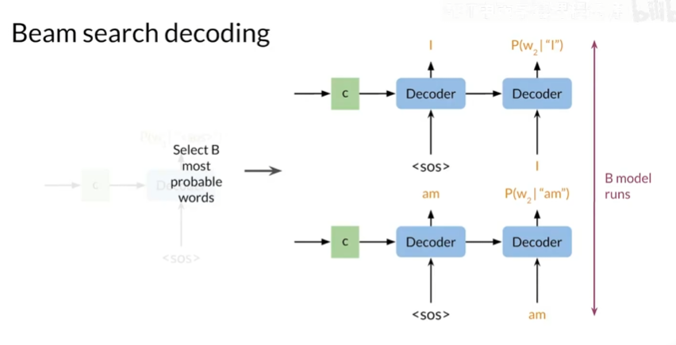  

Problems with beam search  
Penalizes long sequences,so you should normalize by the sentence length  
Computationally expensive and consumes a lot of memory  
# 12.MBR(Minimum Bayes Risk,最小贝叶斯风险)  
Generate several candidate translations  
Assign similarity to every pair using a similarity score(such as ROUGE)  
Select the sample with the highest average similarity  

$\mathop{argmax}\limits_E\frac{1}{n}\mathop{\Sigma}\limits_{E'}ROUGE(E,E')$  

Better performance than random sampling and greedy decoding.  


